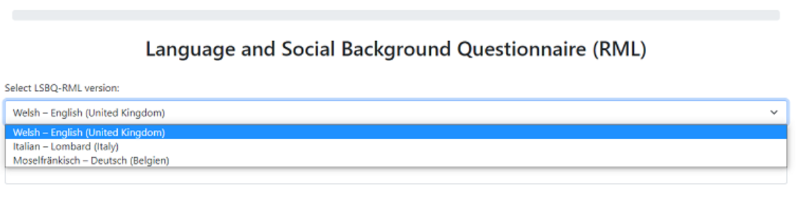
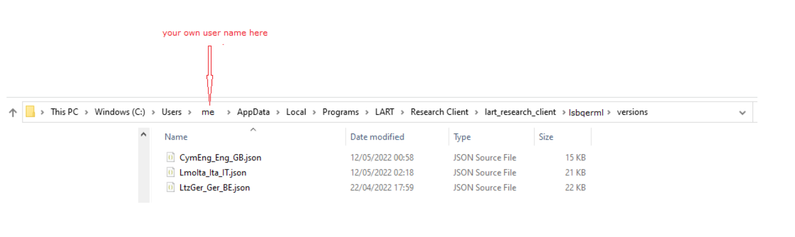
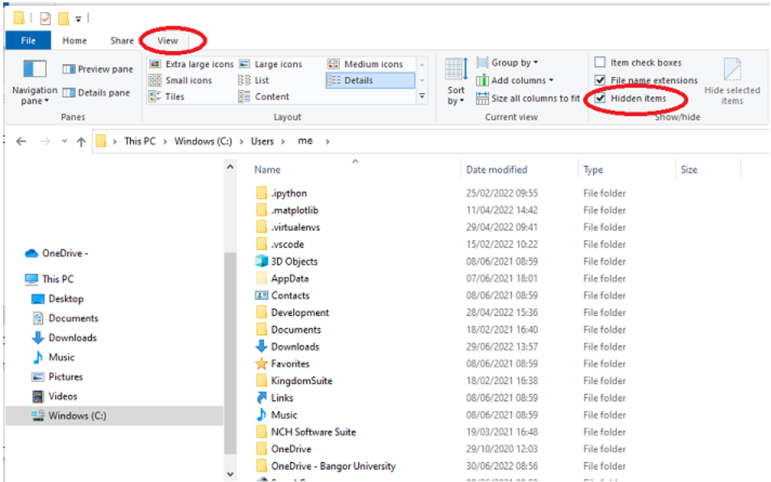
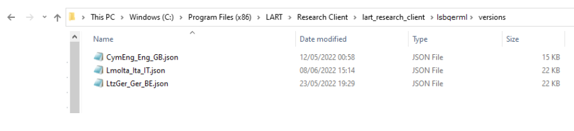
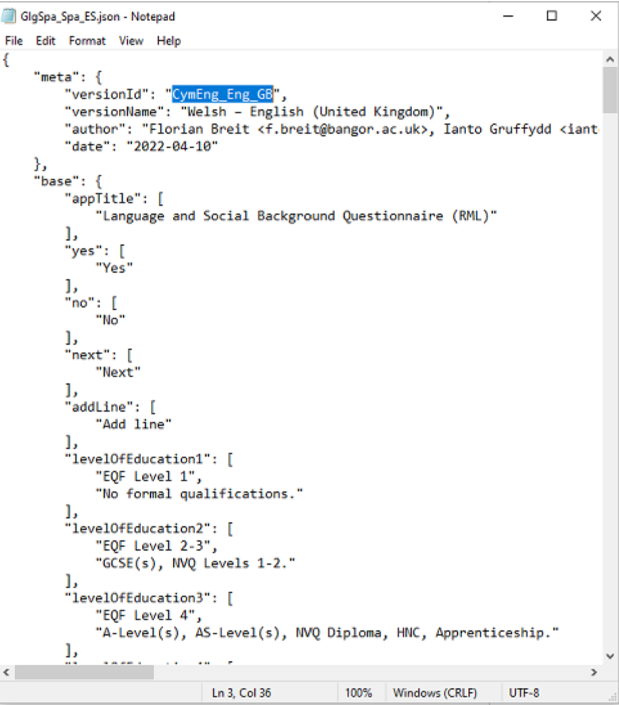
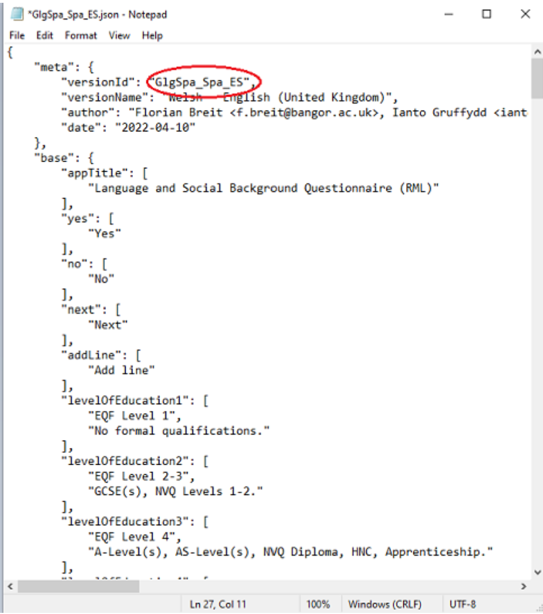
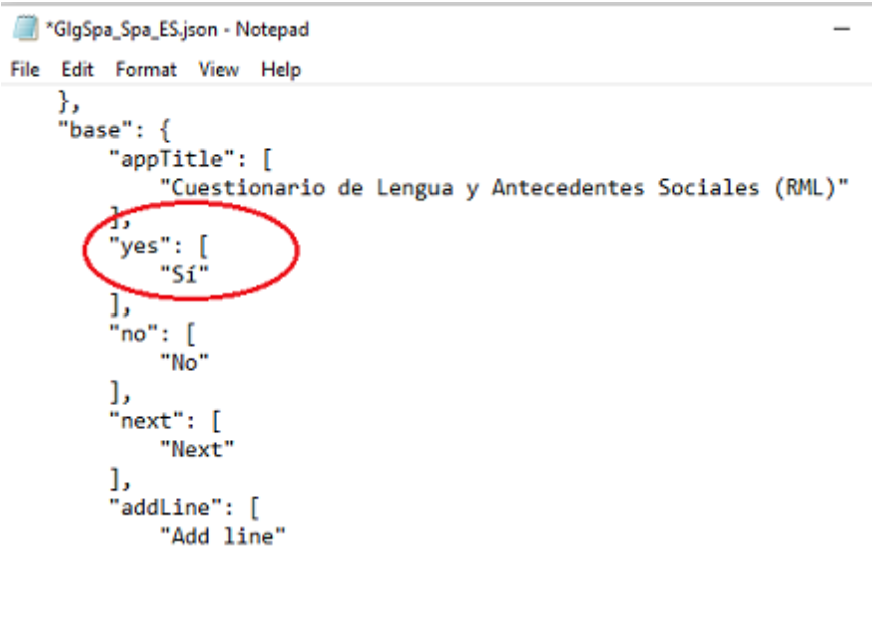
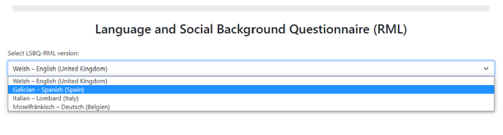

Localisation and Adding Translations
====================================

The LSBQe is designed to allow easy implementation of interfaces in any language you choose.

At the moment, the languages available are English, German, Italian, and Welsh, and the setup is for three bilingual communities: Welsh-English, Lombard-Italian and Moselle Franconian-German: 

      Figure 1 - Selecting a version of the LSBQe 

However, both the working languages and the setup for specific bilingual communities can be easily changed by providing a translated version to suit your own research settings.

To do this, you need to create a new file, provide a translation for each interface item and then save it with a specific naming convention. Each step is outlined below.

Creating and Naming your file
-----------------------------

To create a new file for your translation, go to the location where the LART app is installed, and open the “versions” folder.

Below is the path you need to follow in order to find it. Which path your app is located in depends on whether you installed the app for a single user or for all users (you will have made this choice on installation).

Below is an example of the path when the app is installed for a single user: 

    Figure 2 - Finding the “versions” folder if you installed LART Research Client for a single user

Sometimes Windows hides the folder :file:`“AppData”`` from view. You can make it visible by clicking on the :guilabel:`“view”`` tab and ticking the box labelled :guilabel:`“Hidden files”` as follows: 

    Figure 3 

If you installed the app for all users, you will find the “versions” folder by following a different path, as below: 

    Figure 4 - Finding the “versions” folder if you installed LART Research Client for all users 

To have an interface in the language of your choosing, open the file called :file:`“CymEng_Eng_GB.json”`, which is the British-English version of the interface built to work with Welsh-English bilinguals.

You can open this in **Notepad**, or any text editor of your choice.

Go to :guilabel:`“file”`` and then :guilabel:`“save as”`, and save it with a new name that includes the **language** and a **label** for the bilingual community you plan to study.

.. note::
    Naming needs to be done in a specific manner so that the app can find and read the translation you provide.

    The naming convention adopted in the L’ART Research Client is based on ISO 639 codes for the languages (found `here <https://iso639-3.sil.org/code_tables/639/data>`_)
    and on ISO 3166-1 alpha-2 codes for the countries (click `here <https://www.nationsonline.org/oneworld/country_code_list.htm>`_ for example), but uses capital letters
    for the language codes in keeping with CamelCase (click `here <https://legacy.python.org/dev/peps/pep-0008/#naming-conventions>`_ for example) as follows:

.. figures:: tutfigures/naming-conventions.png
    :width: 400

Therefore, the Italian language file to be used for research with the Lombard-Italian bilingual community based in Italy is named: :file:`lmoIta_Ita_IT.json`. 

So, if you would like to provide a Modern Standard Arabic translation **(Iso code: arb)** to study a bilingual community in Morocco **(ISO code: MA)**
whose native languages are Moroccan Arabic **(ary)** and Berber **(ber)** you would label your file :file:`“BerAry_Arb_MA.json”`.

Similarly, if you would like to provide a Spanish translation **(Iso code: spa)** to study a bilingual community in Spain **(ISO code: ES)**
whose native languages are Galician **(glg)** and Spanish **(spa)**, you would label your file :file:`“GlgSpa_Spa_ES.json”`.

Adding your translation
-----------------------

Your newly created file will now be identical to the original British-English file, except for its name. 

Now it’s time to add your translation. 

The translation file involves **two** main pieces of information: a **set of labels** and a **language output**.

The labels are what the L’ART Research Client needs in order to function, while the language output is what you will see in your interface.

To provide your translated version, you need to highlight each bit of language output and replace it with your translation.

Make sure you **do not** change the labels though, otherwise the app will not find your translation and will output the default English version. 

First, you need to provide some basic information about the file. This is the information under the header **“meta”**. 
With your new file open in a text editor, begin by highlighting the language output for the label :file:`“versionId”`, as follows: 

Then, replace it with the code for your translation. Using our Galician-Spanish example above, this will look as follows: 

Now go through each item and provide the relevant information for the header :guilabel:`“meta”`, namely:

# The version name
# The authors’ / author’s name(s) and email address(es)
# The date that the file is created.

Once you’ve completed that, you may begin the translation properly. 

Highlight each language output for each item and provide your translation.

For example, under the label :guilabel:`“yes”`, you would replace the output **“Yes”** with **“Sí”**, taking care not to change the label, which **must remain “yes”**, as follows:

And that’s it! Once you have replaced all items with your translations, **restart the app** and you will see your Galician-Spanish version, like so: 

