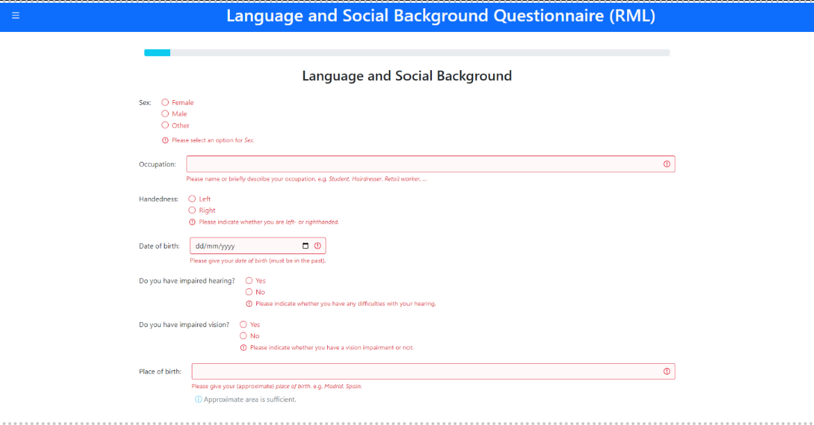

Collecting Data
===============

Commencing data collection and gaining consent 
----------------------------------------------
There are two possible paths available to the researcher to collect data with the L’ART Research Client.
Your preference will depend on how you wish to obtain informed consent from your participants. 

Should you wish to obtain your participants’ consent on paper for any reason (e.g., you require your participant’s signature, or you prefer to work with physical copies of ethics-related documentation)
then you will start data collection by clicking directly on the research tool you require (e.g., **LSBQe**) under :guilabel:`‘Choose a task’` on the app’s home screen.   

The second option offers the researcher an integrated digital avenue to obtain informed consent, which negates the
need to handle physical information sheets, consent forms and signatures. 

This can be done by using the generic consent form provided (see section **[NUMBER]** of the documentation) or by linking it to your
own digital consent form (see section **[NUMBER]** of documentation for instructions on how to add a custom consent form). 

.. / add section number in

Obtaining consent in the app
----------------------------

To obtain consent digitally, open the side menu on the top left-handby clicking on the "burger menu" icon. 
Then click on :guilabel:`informed consent`.

.. figure:: figures/figure10.png
      :width: 350
      :alt: Screenshot of the L'ART Research Clients' side menu

      Figure 10 - The side menu of the L'ART app

    

      Figure 11 - Participant consent start screen

After selecting the required language version and entering a unique participant ID, your study’s consent form, 
information sheet and eligibility criteria will appear below. 

If the participant gives their consent and confirms their eligibility through marking their respective boxes, they will be
automatically advanced to the start screen for the first task (at present always the LSBQe).  

The task start screen is the same start screen that researchers who opt for the LSBQe without digital
informed consent will see after they select the LSBQe task from the app home screen.

The next sub-section discusses how to collect LSBQe responses with the app.

Collecting LSBQe responses
--------------------------

Upon starting the LSBQe, you are first asked to enter the relevant information for your study. These are:

#. Which version of the LSBQe you require, i.e. what localisation is pertinent to your study, in which determines factors
   such as the primary (and possibly secondary) language displayed during the LSBQe, the suggested list of alternative 
   languages, and the education level indicators.

#. A researcher ID, e.g., the name of the researcher conducting your experiment.

#. The location, i.e., the area, city, or town where the research is being undertaken.  

#. A participant ID, i.e., the unique pre-assigned ID for your participant.

#. Consent confirmation, i.e. whether the participant has given their consent (either digitally or on paper).  

.. note::
    If you have collected consent via the digital consent form in-app, the app will pre-populate the information
    on this page using the information entered previously on the informed consent form.

.. figure:: figures/figure12.png
      :width: 400
      :alt: Screenshot of the first screen of the LSBQe

      Figure 12 - The first screen of the LSBQe

The task start screen is followed by the three main sections of the LSBQe on Language and Social Background, Language and Dialect Background, and Community Language Use Behaviour respectively. 

*For more details on the contents of the LSBQe and how this differs from the standard version of the LSBQ, see the documentation of the LSBQe: [INSERT LINK]*

User input on the LSBQe
-----------------------

This sub-section describes how user input is collected on the LSBQe. While the LSBQe can be completed with a
touch interface or keyboard-only input, we strongly recommend that users are provided with access to both a
keyboard and a pointing device (e.g., a mouse or trackpad), as this ensures the best user experience and the
sliders used to collect continuous data are more accurate when used with a pointing device rather than a keyboard.

Any mandatory fields that haven’t been completed by the participant will be flagged up if the user attempts to continue
to the next page without having fully completed any section of the LSBQe or the response entered in a field is invalid 
(e.g. text entered in a field expecting a date). 

The user is given instructions on how they should complete the missing fields if this happens. 

For researchers using the app, or a specific localisation of the LSBQe for the first time, it might be useful to complete 
the LSBQe and purposely leave all fields blank before trying to submit so they can read through and familiarise themselves
with the user-feedback provided for each field.  

      Figure 13 - Mandatory fields that remain unanswered or contain invalid input will be flagged in red

A significant portion of the LSBQe’s answers make use of sliders. Sliders are displayed in a lighter hue with their indicator
displayed in the middle by default, and they have to be moved **at least once** for the answer to be valid. 

Once moved, the slider will turn a darker shade of blue to show that the slider is active and has been moved by the participant.

Should the participant want to keep the slider in the middle of the bar, the slider will need to be moved once and then moved back to the middle point of the bar.

If the participant fails to move the slider, a red flag will appear **(see Figure 13)** and the participant will not be able to advance 
*(though note that some sliders provide a ""not applicable" tickbox, which negates the need for the user to interact with that slider).*

      Figure 14 - The slider function

Once the three main sections of the LSBQe have been completed, and before submitting the data, the participant will be asked if there’s anything else
that they think is important for the researchers to know. If so, they may enter this information in the box provided. This is optional, however,
it can be an effective way to elicit qualitative data from the participant, and it gives participants the chance to clarify or alert the researchers
to anything they thought might not have been accurately captured by the standardised approach of the LSBQe.

.. figure:: figures/figure15.png
      :width: 600
      :alt: Screenshot of LSBQe submission page

      Figure 15 - LSBQe submission page

Locking and unlocking the app
-----------------------------

The app is always in a “locked” state when it is first started. The locked state prevents the user from (accidentally or purposely) carrying out certain actions,
such as inspecting the logic behind the forms they see or using right-click context menus to reload or revert to an earlier screen. Done unintentionally,
this could lead to invalid, corrupted, or duplicate responses, and/or might give the participants information about the administered tasks that the researchers
might not want them to have (at the point of data collection).

Researchers might find it useful however to unlock the app and access such functionality from time to time. For example to go back to the previous screen if
an error was inadvertently made, or to reload the current screen if for any reason something isn’t rendered correctly. Unlocking the app is also useful for
researchers who develop new localisations of a task (see **[INSERT LINK]**). 

.. figure:: figures/figure16.png
      :width: 400
      :alt: Screenshot of LART Research Client menu

      Figure 16 - Open the sidebar to unlock the app

To unlock the app, open the side menu and click :guilabel:`Unlock app`. After unlocking the app, right click and these options (as well as a few more) will be available to you.
If intervening during data collection, it is good practice to lock the app again once the necessary intervention has been carried out. Do this by following the same
steps as for unlocking.  

.. figure:: figures/figure17.png
      :width: 400
      
      Figure 17 - Right click will reveal options available after unlocking the app