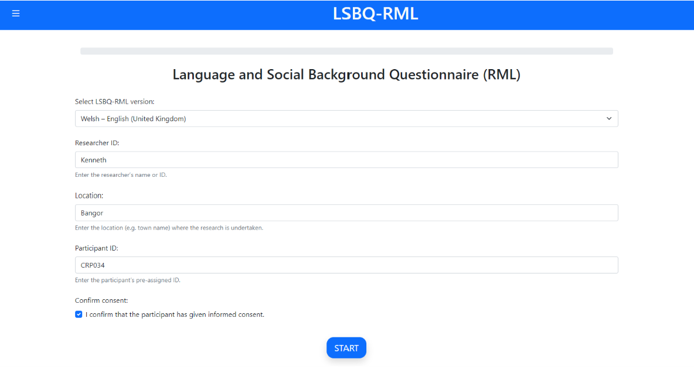
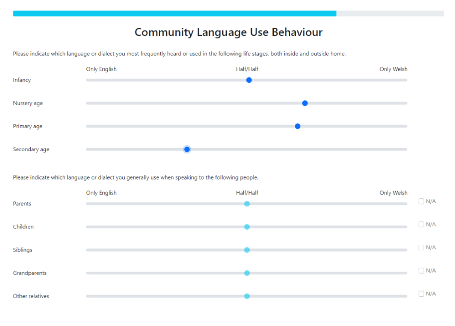

Collecting Responses
====================

Upon starting the LSBQe, you are first asked to enter the relevant information for your study. These are:

#. Which version of the LSBQe you require, i.e. what localisation is pertinent to your study, which determines factors
   such as the primary (and possibly secondary) language displayed during the LSBQe, the suggested list of alternative 
   languages, and the education level indicators.

#. A researcher ID, e.g., the name of the researcher conducting your experiment.

#. The location, i.e., the area, city, or town where the research is being undertaken.  

#. A participant ID, i.e., the unique pre-assigned ID for your participant.

#. Consent confirmation, i.e. whether the participant has given their consent (either digitally or on paper).  

.. note::
    If you have collected consent via the digital consent form in-app, the app will pre-populate the information
    on this page using the information entered previously on the informed consent form.

      
      The first screen, using the LSBQe as an example

User input
----------

While all tasks within the L'ART Research Client can be completed with a touch interface or keyboard-only input, we strongly recommend that users are provided
with access to both a keyboard and a pointing device (e.g. a mouse or trackpad). 

This ensures the best user experience and the sliders used to collect continuous data are more accurate when used with a pointing device rather than a keyboard.

A significant portion of the tasks available on the L’ART Research Client make use of sliders. Sliders are displayed in a lighter shade with their indicator displayed
in the middle by default, and they must be moved at least once for the answer to be valid.

Once moved, the slider will turn a darker shade of blue to show that the slider is active and has been moved by the participant.

Should the participant want to keep the slider in the middle of the bar, the slider will need to be moved once and then moved back to the middle point of the bar.

If the participant fails to move the slider, a red flag will appear **(see Figure //)** and the participant will not be able to advance 

.. note::
    Some sliders provide a **"not applicable"** tickbox, which negates the need for the user to interact with that slider.

      The slider function, using the LSBQe as an example.
