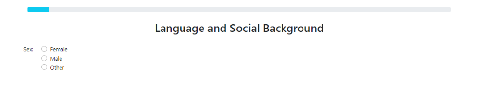
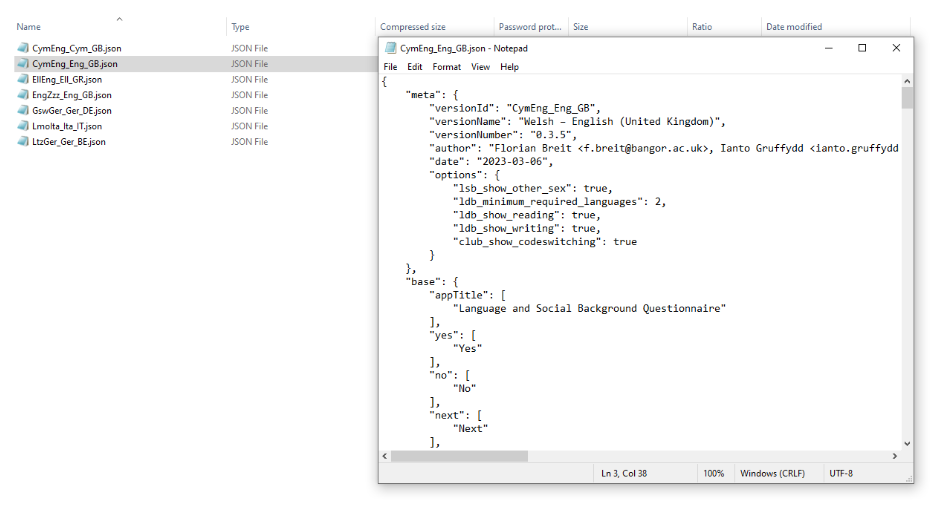
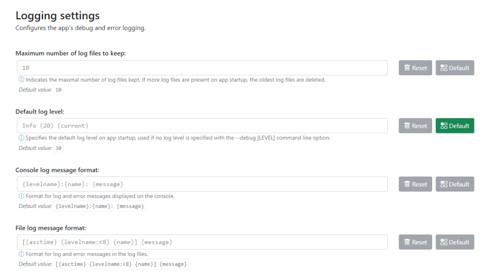

Configuring the app for your needs
==================================

The app’s settings can be accessed via the app side menu. There are numerous aspects of the app that 
can be changed on the settings page. The various options are discussed in some detail below. 

Remember to click :guilabel:`Save changes` and restart the app in order for the changes you make to take effect. 

      Figure 21 - Open the sidebar to enter settings

Shutdown delay
--------------

Shutdown delay is the amount of time the app’s backend process (basically, what you can see in the terminal window)
waits before closing after you close the main app window.

Under normal circumstances there should be no need to adjust this. However, it can be beneficial to increase the shutdown
delay when using an underpowered device e.g., a 4GB Surface Tab Go or some other device not meeting the recommended system requirements
(see `System Requirements <file:///C:/Users/admin/Documents/lart-research-client/docs/build/html/users/system-requirements.html>`_ for more information). 

Problems with limited system resources can lead to the app freezing or becoming unresponsive. Increasing the shutdown
delay means that the app will wait longer in case the system temporarily delays the processing of expected signals and information. 

      Figure 22 - Editing shutdown delay

Logging settings
----------------

Logging settings involves the app’s debug and error logging functionality. While you will not usually have to access these files,
they can contain useful information for researchers developing an extension for the app, those creating a new localisation of a task,
or generally for diagnostic information if an unexpected error occurs. 

You may be asked for information from the log files if you report a bug, which will help us to reconstruct what happened when the error
occurred on your computer. 

    .. warning::

                The log files may potentially contain any of the information that a user/researcher/participant enters into the app while it is running. 
                
                For this reason, **you must apply the same information security policies to the log files as you do to the response data itself.** 

                If you share log files with a third party, you should ensure that they do not contain identifiable data which you would not otherwise
                share with that party. 
                
                You may want to "sanitise" your log files *(by manually removing any sensitive/identifiable data)* before sharing
                them and/or make sure that the other party is aware and capable of keeping this data secure in line with your policies.

The maximum number of log files to keep determines how many logs from previous runs of the app are kept, and once this number is reached old logs are deleted.
By default, the app keeps logs files for the last 10 times it was started. 

The log level determines how detailed the log files are. The lower the numeric level, the more detail is stored in the log files. 

Lowering the log level might be useful if you try to diagnose an error or bug and it is not apparent what led to the undesired behaviour from the existing logs
(but we recommend not doing this "just in case", as the amount of information might be overwhelming with log levels below 30). 

The log message format is only relevant for advanced users and developers who may want to format logs in a specific way for working with their
preferred analysis tools. If you are not sure what this is or how it works, there is no need for you to modify it. 

For details on the formatting see the documentation of the :py:mod:`logging` package in the Python standard library.

      Figure 22 - Logging settings

