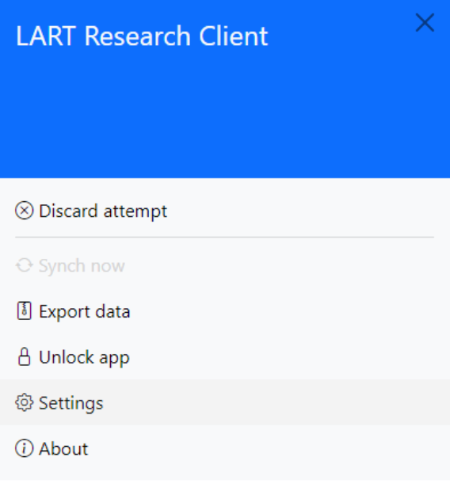
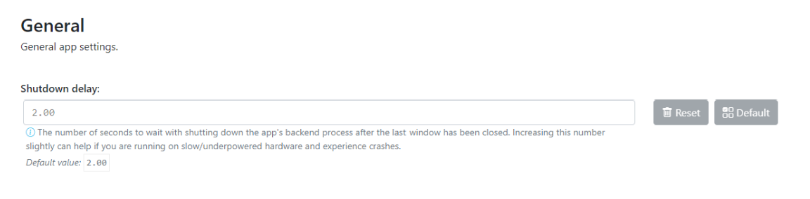
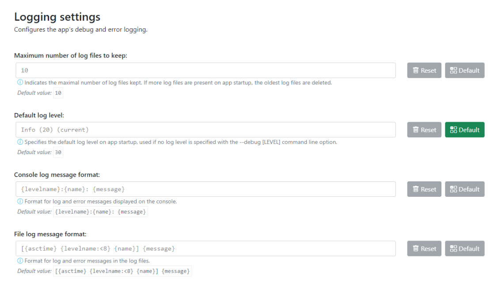
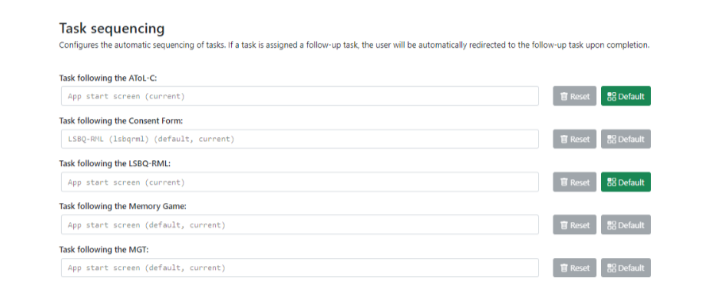
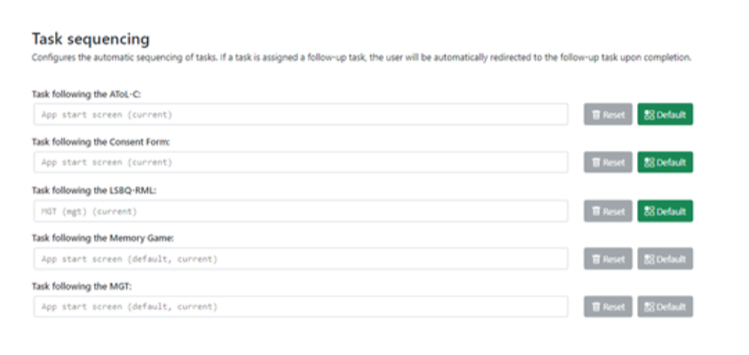
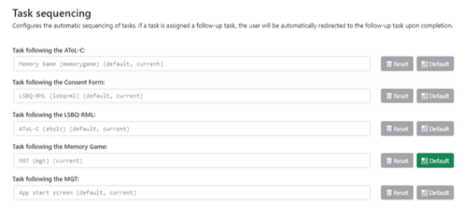

App Settings
============

The app’s settings can be accessed via the app side menu. There are numerous aspects of the app that 
can be changed on the settings page. The various options are discussed in some detail below. 

      Open the sidebar to enter settings

Remember to click :guilabel:`Save changes` and restart the app in order for the changes you make to take effect. 

.. tip::

   If you modify a setting, it will show up in gold.
   Pressing the red :guilabel:`Reset` button will revert to the previous setting.
   Pressing the green :guilabel:`Default` button will revert to the default setting.
   This is illustrated in Figure 10:

   .. figure:: figures/task-sequencing-modified.png
      :width: 400
      :alt: Screenshot of modified task sequencing

      Settings interface with modified task sequencing

General settings
----------------

The general settings section is used to configure basic running parameters of the app. These typically do not need to be adjusted.

      Editing shutdown delay in the *general settings*

.. confval:: Shutdown delay
      :type: Real number
      :default: :code:`2.00`

      Shutdown delay is the amount of time (in seconds) that the app’s backend process (basically, what you can see in the terminal window)
      waits before closing after you close the main app window.

      Under normal circumstances there should be no need to adjust this. However, it can be beneficial to increase the shutdown
      delay when using an underpowered device e.g., a 4GB Surface Tab Go or some other device not meeting the recommended system requirements
      (see :doc:`system-requirements` for more information). 

      Problems with limited system resources can lead to the app freezing or becoming unresponsive.
      Increasing the shutdown delay means that the app will wait longer in case the system temporarily delays the processing of expected signals and information. 

Logging settings
----------------

Logging settings involves the app’s debug and error logging functionality. While you will not usually have to access these files,
they can contain useful information for researchers developing an extension for the app, those creating a new localisation of a task,
or generally for diagnostic information if an unexpected error occurs. 

You may be asked for information from the log files if you report a bug which will help us to reconstruct what happened when the error
occurred on your computer.

      Logging settings

.. warning::

      The log files may potentially contain any of the information that a user/researcher/participant enters into the app while it is running. 
                
      For this reason, **you must apply the same information security policies to the log files as you do to the response data itself.** 

      .. collapse:: Sharing log files

         If you share log files with a third party, you should ensure that they do not contain identifiable data which you would not otherwise
         share with that party. 

         You may want to "sanitise" your log files *(by manually removing any sensitive/identifiable data)* before sharing
         them and/or make sure that the other party is aware and capable of keeping this data secure in line with your policies.

.. confval:: Maximum number of log files to keep
      :type: Integer
      :default: :code:`10`

      The maximum number of log files to keep determines how many logs from previous runs of the app are kept, and once this number is reached old logs are deleted.
      By default, the app keeps logs files for the last 10 times it was started. 

.. confval:: Default log level
      :type: Integer
      :default: :code:`30`

      The log level determines how detailed the log files are. The lower the numeric level, the more detail is stored in the log files. 

      Lowering the log level might be useful if you try to diagnose an error or bug and it is not apparent what led to the undesired behaviour from the existing logs
      (however, we recommend **not** doing this "just in case", as the amount of information might be overwhelming with log levels below 30).

.. confval:: Console log message format
      :type: String
      :default: :code:`{levelname}:{name}: {message}`

      Modifies the format of log messages shown in the console window that runs in the background of the app.

      The log message format is only relevant for advanced users and developers who may want to format logs in a specific way for working with their
      preferred analysis tools. If you are not sure what this is or how it works, there is no need for you to modify it. 

      For details on the formatting see the documentation of the :py:mod:`logging` package in the Python standard library.

.. confval:: File log message format
      :type: String
      :default: :code:`[{asctime} {levelname:<8} {name}] {message}`

      Modifies the format of log messages stored in the log files while the app is running.

      The log message format is only relevant for advanced users and developers who may want to format logs in a specific way for working with their
      preferred analysis tools. If you are not sure what this is or how it works, there is no need for you to modify it. 

      For details on the formatting see the documentation of the :py:mod:`logging` package in the Python standard library.

Path and directory settings
---------------------------

The path and directory settings configure the paths used by the app for storing and reading various files, such as the data collected from participants,
the app settings, and the log files.

If paths are modified it is best to always restart the app and fully test that everything is working as expected, including inspecting the
stored data files after running a task.

.. Insert screenshot?

On Windows, the app by default uses paths in the so-called *roaming* profile to store settings and data. This means that if you install the app on a
networked domain computer, it's settings and data will transfer across to other computers in the domain where you log in with the same credentials.
This is of course provided your system administrators have not modified the behaviour for roaming profiles on the domain, so it's a good idea to check
for yourself that this works when you log in to other computers if you plan on relying on this feature in some way (we always recommend making your
own backups and not overly relying on system backup features --- those should be seen more as a second-line defense or 'backup of the backup' if anything).

.. warning::

   It is strongly recommended that you do not modify any of the app paths unless you are positively confident that you know what you are doing.
   Incorrect path information could lead to unstable behaviour and in the worst case even data loss.

.. confval:: Path for configuration files
      :type: Path to a directory
      :default: :code:`%AppData%\\LART\\Research Client` (on Windows)

      This is the path where the app will look for configuration files (such as :file:`settings.json`, the file in which these settings are stored).
      As opposed to the other paths, changes to the value here will have no discernible effect and will revert automatically upon start-up.
      The path for configuration files thus mainly has informational value.

.. confval:: Path for data files
      :type: Path to a directory
      :default: :code:`%AppData%\\LART\\Research Client\\Data` (on Windows)

      This is the path where data files, i.e. the participants' responses, from the app tasks are stored.

.. confval:: Path for log files
      :type: Path to a directory
      :default: :code:`%AppData%\\LART\\Research Client\\Logs` (on Windows)

      This is the path where the app's log files are stored and will be handy to know if you ever have to debug or report an error. However,
      note the potential data security policy implications noted in the `Logging settings`_ section above.

.. confval:: Path for temporarily cached data and files
      :type: Path to a directory
      :default: :code:`%LocalAppData%\\LART\\Research Client\\Cache` (on Windows)

      This is the path to a directory where the app may temporarily cache (sore, modify, delete) various filed during operation.

Task sequencing
---------------

The task sequencing settings allows you to configure which tasks (if any) should follow the completion of a specific task.
This facilitates a more convenient data collection process where the user is automatically directed to the next task without
the need for researcher intervention. This also negates the need to re-enter participant details (and the associated margin
for error) at the start of each task, as these are transferred across tasks automatically.

.. See section XX in (Breit et al. 2023).   

.. rubric:: Example: The default LSBQe sequence

For example, with the default settings, when the informed consent task is completed the participant will be automatically advanced to the LSBQe,
and when the LSBQe is complete they will be sent to the conclusion screen before then being redirected to the app home screen (see Figure 12).

      Default sequencing: *Consent Form* > *LSBQe* > *Conclusion Screen* > *App start screen*

.. Update Figure 13 above!

Note also that the sequencing doesn't rely on the entry point. If the participant is starting directly with the *LSBQe* in the default sequence,
they will then still follow the remainder of that sequence, i.e. the *Conclusion Screen* followed by the *App start screen*.

.. rubric:: Example: A custom sequence

You could decide to use any possible sequence consisting of available tasks, though note that you should only use the *Conclusion Screen* for
the end of the sequence.

For instance, you may not want to require an electronic consent form for your study, thus removing the consent form from the sequence, and may want
the LSBQe to advance into the AGT as is typical in linguistic studies where a background questionnaire precedes the main research method, followed by
a conclusion screen to inform the participant they have completed all tasks and that they should await further instruction from the researcher. This
sequencing is demonstrated in Figure 13:

      Customised sequence: *LSBQe* > *AGT* > *Conclusion Screen* > *App start screen* 

Should you require every available task to be sequenced, you may also do so, as shown in Figure 14:

      *Consent Form* > *LSBQe* > *AToL-C* > *Memory Task* > *AGT* > *Conslusion Screen* > *App Start screen*
