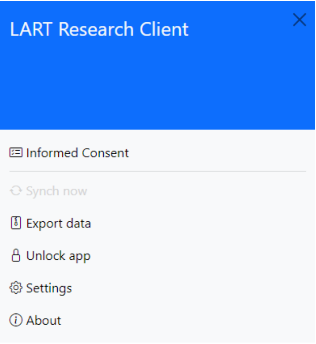
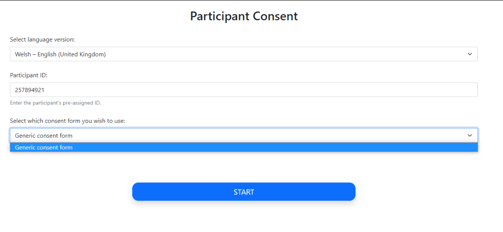

.. _collecting-consent:

Setting up data collection and obtaining consent
================================================

There are two possible paths available to the researcher to collect data with the
L’ART Research Client. Your preference will depend on how you wish to obtain informed
consent from your participants. 

Should you wish to obtain your participants’ consent on paper for any reason (e.g., you
require your participant’s signature, or you prefer to work with physical copies of
ethics-related documentation) then you will start data collection by clicking directly on
the research tool you require under Choose a task on the app’s home screen.

In the current version (|version|), the tasks available are: :guilabel:`LSBQe`,
:guilabel:`AToL`, :guilabel:`AGT`, and :guilabel:`Memory Task`.

The second option offers the researcher an integrated digital avenue to obtain informed consent,
which negates the need to handle physical information sheets, consent forms and signatures. 

This can be done by using the generic consent form provided (see
:numref:`data_setup_rc_side_menu` & :numref:`data_setup_participant_consent_screen`)
or by linking it to your own digital consent form.

.. (see section **[insert link]** for instructions on how to add a custom consent form). << Ask where custom consent form is on the doc

To obtain consent digitally, open the side menu on the top left-handby clicking on the
"burger menu" icon. Then click on :guilabel:`Informed Consent`.

      The side menu of the L'ART app

      Participant consent start screen

After selecting the required language version and entering a unique participant ID, your study’s consent form,
information sheet and eligibility criteria will appear below. 

If the participant gives their consent and confirms their eligibility through marking their respective boxes, they will be
automatically advanced to the start screen for the first task (see :ref:`task-sequencing` on how to set this).  

The task start screen is the same start screen that researchers who opt for the LSBQe task without digital informed consent will see after they select a task from the app's home screen. 
