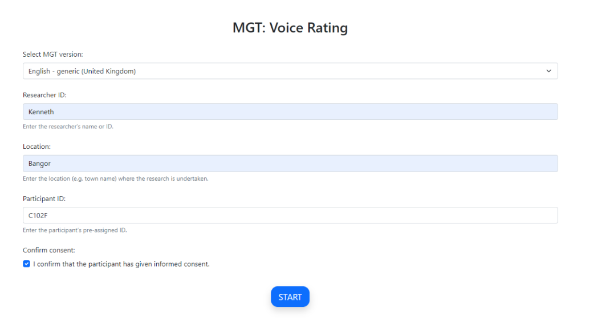
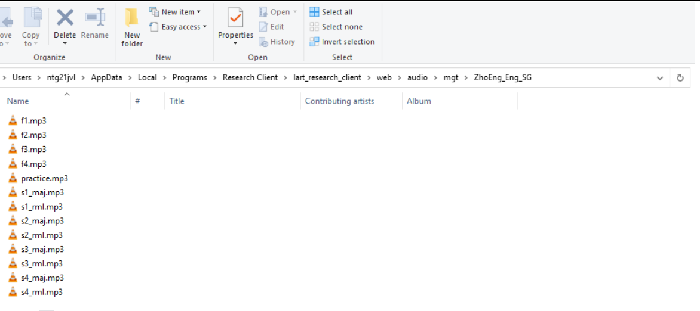

Setting up data collection and obtaining consent 
================================================
There are two possible paths available to the researcher to collect data with the L’ART Research Client.
Your preference will depend on how you wish to obtain informed consent from your participants. 

Should you wish to obtain your participants’ consent on paper for any reason (e.g., you require your participant’s signature, or you prefer to work with physical copies of ethics-related documentation)
then you will start data collection by clicking directly on the research tool you require under :guilabel:`‘Choose a task’` on the app’s home screen.

In the current version **[version]**, the tasks available are LSBQe, AToL, AGT, and Memory Game.

**[Insert Screenshot]**

The second option offers the researcher an integrated digital avenue to obtain informed consent, which negates the
need to handle physical information sheets, consent forms and signatures. 

This can be done by using the generic consent form provided (see section **[insert link]**) or by linking it to your
own digital consent form (see section **[insert link]** for instructions on how to add a custom consent form). 

.. / insert section numbers?

To obtain consent digitally, open the side menu on the top left-handby clicking on the "burger menu" icon. 
Then click on :guilabel:`informed consent`.

.. figure:: figures/figure10.png
      :width: 350
      :alt: Screenshot of the L'ART Research Clients' side menu

      Figure 10 - The side menu of the L'ART app

    

.. figure:: figures/figure11.png
      :width: 600
      :alt: Screenshot of Participant consent start screen

      Figure 11 - Participant consent start screen

After selecting the required language version and entering a unique participant ID, your study’s consent form, 
information sheet and eligibility criteria will appear below. 

If the participant gives their consent and confirms their eligibility through marking their respective boxes, they will be
automatically advanced to the start screen for the first task (see [task sequencing link] section on how to set this).  

The task start screen is the same start screen that researchers who opt for the LSBQe without digital informed consent will see
after they select a task from the app's home screen. 

The next section discusses how to collect responses for each task available in the L'ART Research Client: **LSBQe, AToL,** and **AGT**.

////////////////////////////////////
Notes - make a new section for below:
-----------------------------------

The Audio Guise Test (AGT) allows users to run either a Matched Guise Technique (MGT; Lambert, Hodsgon, Gardner & Fillenbaum, 1960)
or a Verbal Guise Technique (VGT; Markel, Eisler & Reese, 1967). (See **Breit et al., 2023** for more details)

Differentiation between MGT or VGT is executed via your audio recordings.

Firstly, the AGT requires thirteen recordings in order to function. Eight recordings are classed as experimental recordings, four are classed as filler recordings and one is a practice recording.

For an MGT setup, you must load **eight experimental recordings** from **four speakers**
with each speaker providing a recording in either language variety. 

For a VGT setup, you would load eight experimental recordings from eight speakers, with four speakers
providing a recording in one language variety, and the other four speakers providing a recording in the other language variety.

What to do with the four fillers are left up to the researcher. for instance, in an MGT setup, continuity with experimental stimuli may be preferred,
so the four fillers could be recorded by two speakers, with both speakers providing a recording in each language variety.
Contrarily, the researcher may prefer all fillers to be recorded by one speaker in one language.

The practice guise is presented first during an AGT and allows the participant to familiarise themselves with an AGT without testing experimental stimuli.
Practice stimulus design is decided by the researcher, for instance, a researcher may wish to produce a recording of themselves talking about a neutral
topic for the same length as the experimental and filler recordings.

Sounds files must be labelled appropriately in order for the AGT to execute the sound files.

Practice guise should be marked with “practice”; fillers should be marked with “F” plus the number of the filler; and experimental guises should be marked “s” plus number to denote your speaker, then underscored
before either “maj” or “rml” denoting the language variety. These are labels that must be assigned on the file names relating to the respective language varieties of AGT recordings, it is the researcher’s decision
which language they assign the “maj” label to, and which language they assign the “rml” label to. Language variety should be **consistent for all speaker recordings**, so in the example below in Figure 25, “maj” should
indicate Chinese recordings and “rml” should indicate English recordings consistently. 

.. note::

It should be noted that the example shown in Figure 25 is for an MGT.

**All sound files must be in mp3 format.**

To load your own recordings for the AGT, firstly, open the folder :guilabel:`[mgt]` by following the path below:

:guilabel:`C:\Users\username\AppData\Local\Programs\LART\Research Client\lart_research_client\web\audio\mgt`

Create a new folder which follows the ISO standard code sequence (see XX for standard code sequence generating) to hold the sound files for your AGT.
For example, for an AGT set-up to work with Chinese-English bilinguals in Singapore and use English as the language of presentation,
you would create a folder called **“ZhoEng_Eng_SG”**, as follows:

      Figure 28 - New folder ZhoEng_Eng_SG created following the ISO standard code sequence

Inside your folder, paste your own sound files but copy the standard code sequence described as above for file names for naming your sound files. 

      Figure 29 - Sound file names for AGT following the standard code sequence
 
Your files should now be played when you start the AGT and select the desired AGT version on the start menu. 