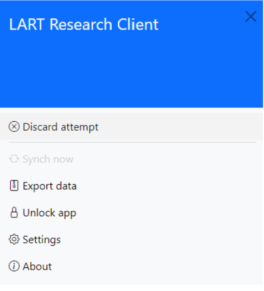

Discarding an attempt in progress
=================================

.. warning::
    The procedure described below might lead to the irretrievable loss of data.
    
    Please ensure that you read this information carefully and understand the ramifications of discarding an attempt before making use of this
    functionality.

Discarding a participant’s attempt at a task can be done straightforwardly at any stage of the data collection process, including during the
consent stage.

To do so, open the side menu and click :guilabel:`Discard attempt`. Once the attempt has been discarded, the app will return to the app home screen. 

Note that discarded responses will not be saved on the device and any information a participant may already have entered for that task will be irretrievably lost.

Discarding an attempt will usually be the appropriate choice where a participant choses to withdraw their consent during the study, and should align with the
ethical procedures in place for your research. If a response has already been submitted successfully and consent is withdrawn retrospectively, the researcher must
manually ensure that data is deleted where that might be required.

    Open sidebar to discard attempt 