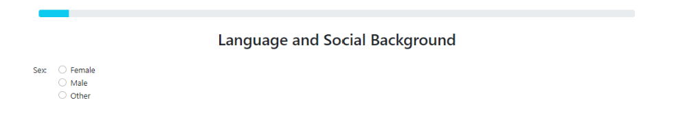
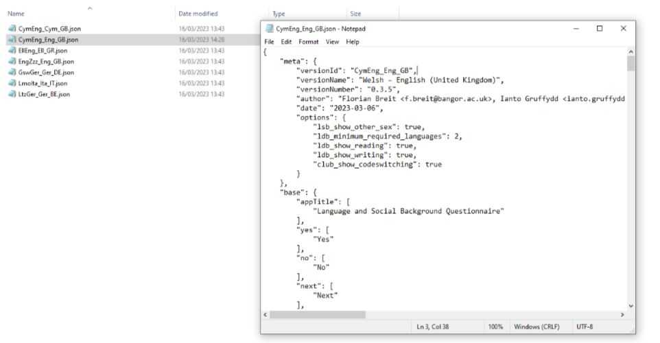

Excludable Questions   
====================

The LSBQe allows users to include or exclude certain questions depending on the nature of the language communities to be researched (see Breit et al. 2023 for details on the rationale behind these choices).

Below you’ll find instructions on which questions allow this option and how to go about excluding them. 

"Other" Sex
-----------

As default, the LSBQe contains three options that a participant may select as their sex: “Female”; “Male”; “Other”. 

      Figure 21 - Default options for sex on LSBQe

However, some researchers may prefer to use a binary choice (e.g., where biological sex is a research variable) and therefore exclude “Other” from the available options. 

To do this, open your LSBQe version file from the following path:

:guilabel:`C:\Users\username\AppData\Local\Programs\LART\ResearchClient\lart_research_client\lsbq\versions`

With the file open, you will see that below the section “options” the line labelled :file:`“lsb_show_other_sex”`` is set to :file:`true`:

.. figure:: figures/figure22.png
      :width: 400
      :alt: Screenshot of the feature 'lsb_show_other_sex' set to "true"

      Figure 22 - The feature "lsb_show_other_sex" set to "true"

To exclude the **“Other”** option in your version of the LSBQe you simply need to set that option to :file:`“false”`.

.. figure:: figures/osfigure23.png
      :width: 400
      :alt: Screenshot of the feature 'lsb_show_other_sex' set to "false"

      Figure 23 - The feature "lsb_show_other_sex" has been changed to "false"

.. note::
      Make sure to restart the app so that the change can take effect.

      Figure 24 - How the question appears in the app after removing "Other"

If you wish to change it back to including **"Other"**, you must reverse the above procedure and change the setting back to :file:`"true"`.

Minimum required languages
--------------------------

In the “Language and Dialect Background” section, the opening question asks participants to list all the languages and dialects that they speak and give information regarding
where they learned each of them, when they learned them, and if there were significant periods where the participant did not use any of them.

By default, the LSBQe  requires a minimum of two required language names, by presenting participants with two blank lines that must be filled before continuing.

While participants have with the option of adding more language varieties via the :guilabel:`Add Line` button (i.e. for participants who are tri or polylingual),
only two lines will appear as default (see Figure 25 below). 

      Figure 25 -  The opening question on the Language and Dialect Background section set to two minimum required languages

Should you wish to make three or more languages the default without having to add more lines, for instance if you’re researching trilingualism within a community,
you may set the minimum required languages to three.

To do this, firstly, open your LSBQe version file from the following path:

:guilabel:`C:\Users\username\AppData\Local\Programs\LART\ResearchClient\lart_research_client\lsbq\versions`

With the file open, you will see that below the section :file:`“options”` the line labelled :file:`“ldb_minimum_required_languages”` is set to **“2”**: 

      Figure 26 -  The feature “ldb_minimum_required_languages” set to “2”   

To change this to a different number, e.g., 3, you simply type “3” in place of “2”: 

      Figure 27 -  Changing the minimum required languages to three

.. note:: 
      Make sure to restart the app so that the change can take effect.

      Figure 28 -  How the question appears in the app with a minimum of three required languages
 
If you wish to change the option back to two languages, you must reverse the above procedure and change the setting back to **“2”**.

Reading and Writing:
--------------------

In the “Language and Dialect Background” section, participants are asked how much time they spend engaged in speaking, listening, reading, and writing in each of their languages.

      Figure 29 - How the question appears in the app with "Reading" and "Writing" options

The “reading” and “writing” parts of the questions can be removed. For example when researching a community whose one or more languages is only/mostly oral
or doesn’t have an accepted orthographic system, making the “reading” and “writing” options irrelevant to participants.  

To remove the “reading” and “writing” options, firstly, open your LSBQe version file from the following path:

:guilabel:`C:\Users\username\AppData\Local\Programs\LART\ResearchClient\lart_research_client\lsbq\versions`

With the file open, you will see that below the section :file:`“options”` the lines labelled :file:`“ldb_show_reading”` and :file:`“ldb_show_writing”` are set to :file:`“true”``: 

      Figure 30 - The features “ldb_show_reading” and “ldb_show_writing” are set to “true” by default 

To exclude these options from your version of the LSBQe, simply change the values to :file:`“false”`: 

      Figure 31 - Setting the "reading" and "writing" options to “false”

.. note::
      Make sure to restart the app so that the change can take effect.

If you wish to change it back to including “reading” and “writing”, you must reverse the process and change the values back to :file:`“false”`.

      Figure 32 - How the question appears in the app with "Reading" and "Writing" options removed 

Show code-switching
-------------------

The LSBQe’s Community Language Use Behaviour section contains a final section on code-switching where participants are asked how often they code-switch in different contexts (see figure XX). 

      Figure 33 - CLUB section with code-switching question included

The code-switching question can be removed if this information is not required in your study.  

To remove the code-switching question, firstly, open your LSBQe version file from the following path: 

:guilabel:`C:\Users\username\AppData\Local\Programs\LART\ResearchClient\lart_research_client\lsbq\versions`

With the file open, you will see that below the section :file:`“options”` the line labelled :file:`“club_show_codeswitching”`` is set to :file:`“true”` (see Figure 34)

      Figure 34 - The feature “club_show_codeswitching” is set to “true” by default

To exclude the code-switching question from your version of the LSBQe, simply change the value to :file:`“false”` (see figure 35)

      Figure 35 - Setting the codeswitching option to “false” 

.. note::
      Make sure to restart the app so that the change can take effect.

After removing the code-switching section, the CLUB section finishes on the question prior to the code-switching question that asks participants to indicate which language or dialect they generally use for various activities (see fig XX).  

If you wish to change it back to including the code-switching question, you must reverse the process and change the value back to :file:`“true”`.

      Figure 36 -  How the question appears in the app with "Reading" and "Writing" options removed 