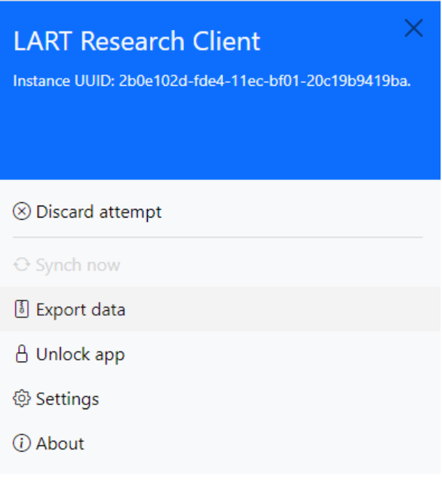
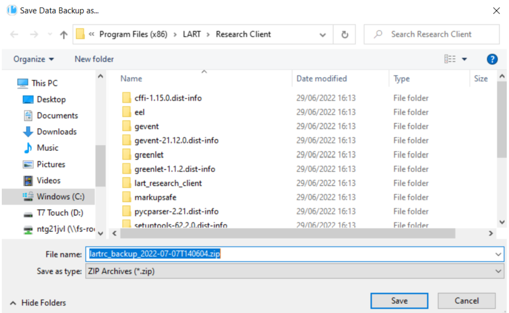

Exporting data
===============

Data for each task (e.g., informed consent, LSBQe) will be automatically stored in a JSON file on the computer
running the app once the participant has submitted  their response. 

However, if you want to export the data manually, e.g., to make a backup to a different location or collate data 
collected on various devices, you can do this straightforwardly on the app.

For the simplest way to do this, open the side menu, and click on :guilabel:`Export Data`.  

      Figure 33- Open the side bar to export data

Once you have clicked on export data, a dialog will appear which allows you to save a ZIP archive containing
all the responses currently stored on the computer in a location of your choice. 

.. note::
      Identify and remember your file path before saving, so that you know where to find your ZIP archive containing the exported data.

      Figure 34 - Saving the exported data

For advanced users who want to automate export or backup of the responses, or monitor and integrate these files
with some other system, the files can be accessed directly on the system. 

On Windows these are stored in the Roaming profile by default, identified by the path :file:`%AppData%\LART\Research Client\data.`

On Mac OS X the default path will be :file:`~/Library/Application Support/Research Client/data.`

For most Linux distributions the default path will be :file:`~/.local/share/Research Client/data.`

.. note::

      **It is best practice to not modify or work with the original data files where this is avoidable.**
      
      This is expected behaviour for unsigned software downloaded from the internet. It is meant to get you to
      check that you've downloaded the Software from a reputable source before running it.
