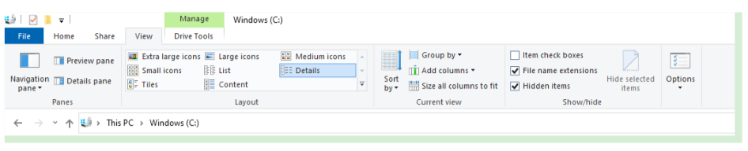
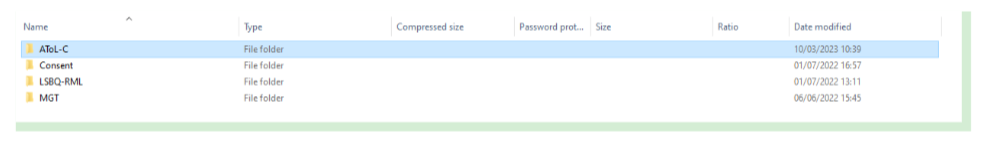
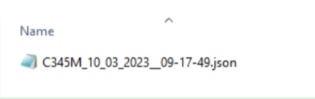
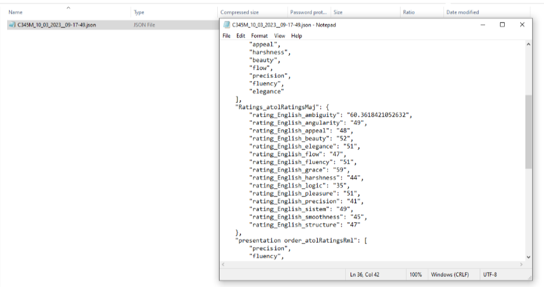

Exporting data
===============

Data for each task (e.g., informed consent, LSBQe) will be automatically stored in a JSON file on the computer
running the app once the participant has submitted  their response. 

However, if you want to export the data manually, e.g., to make a backup to a different location or collate data 
collected on various devices, you can do this straightforwardly on the app.

For the simplest way to do this, open the side menu, and click on :guilabel:`Export Data`.  

.. figure:: figures/exporting-data-side-bar.png
      :width: 400
      :alt:  Screenshot of L'ART Research Client menu

      Open the side bar to export data

Once you have clicked on export data, a dialogue will appear which allows you to save a ZIP archive containing
all the responses currently stored on the computer in a location of your choice. 

.. note::
      Identify and remember your file path before saving, so that you know where to find your ZIP archive containing the exported data.

.. figure:: figures/saving-exported-data.png
      :width: 600
      :alt: Screenshot of saving exported data

      Saving the exported data

Your next step will be to verify that all the data collected appears as it should in your exported ZIP Archive file.

To find your data in order to verify that the data has been backed up correctly, firstly, follow the file path that your ZIP Archive file is located in.

In order to follow the file path, you must show hidden items in the :guilabel:`“view”` section in your **File Explorer**.  

      Tick the "hidden items" box in order to display all of your file path

Next, discover your ZIP Archive exported data file via the following path: 

:file:`C:\\Users\\username\\AppData\\Local\\Programs\\LART\\ResearchClient\\`

Open up your ZIP Archive back up and open the folder that corresponds to the task used in your study. 

For instance, if you’re verifying data that you collected from the AToL, open :file:`“AToL-C”` **(see Figure ///)**.  

      Task folders located in your exported ZIP Archive

Located inside the file will be your :file:`.json data` files, labelled in **“participant_date_time”** format **(see Figure ///)**.

      .json data file in participant_date_time format

File name accuracy should indicate if your data has been collected and exported properly, but you can open the file to verify completely that data was collected and exported accurately.

For instance, in the example below **(Figure ////)**, by observing that each AToL adjective pair, per language, equates to a **number** (how your participant rated the language for the trait via the slider mechanism). 

      Check that your data file contains data inputed by your participant 

For advanced users who want to automate export or backup of the responses, or monitor and integrate these files
with some other system, the files can be accessed directly on the system. 

On Windows these are stored in the Roaming profile by default, identified by the path :file:`%AppData%\\LART\\Research Client\\data.`

On Mac OS X the default path will be :file:`~//Library//Application Support/Research Client//data.`

For most Linux distributions the default path will be :file:`~//.local//share//Research Client//data.`

.. note::

      **It is best practice to not modify or work with the original data files where this is avoidable.**
      
      This is expected behaviour for unsigned software downloaded from the internet. It is meant to get you to
      check that you've downloaded the Software from a reputable source before running it.
