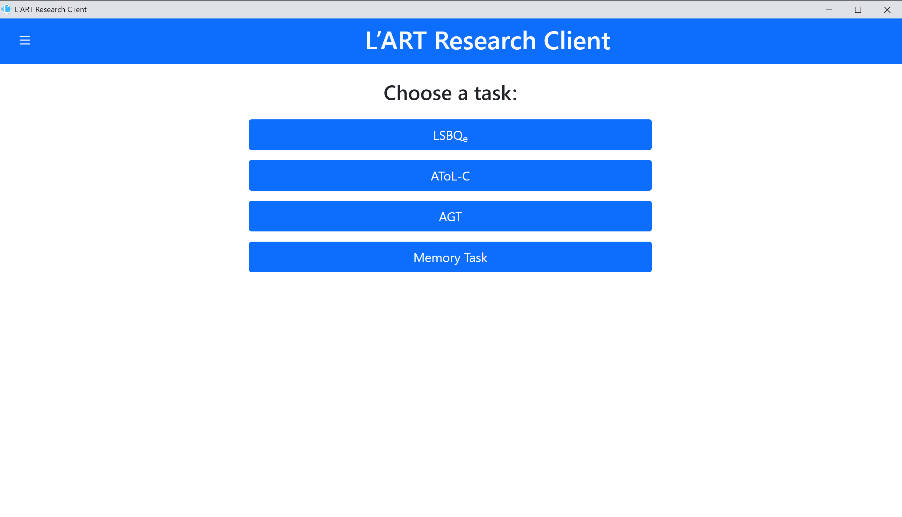
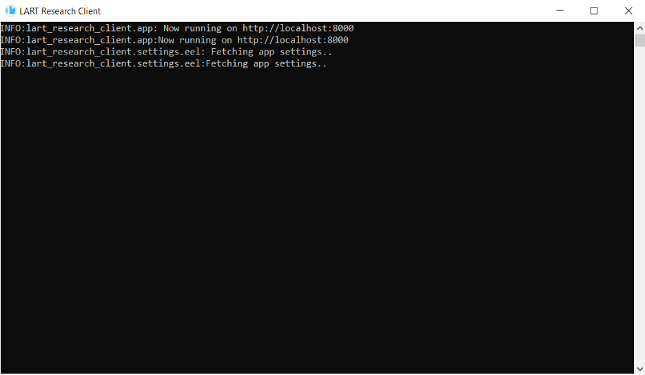

Getting started
===============

Upon starting the app on your device, both the L’ART Research Client app and a terminal window will open. 

      
      L’ART Research Client home screen

      L'ART Research Client Terminal

The terminal window prints out information that might be helpful with troubleshooting and should not be closed 
(the app will freeze/become unresponsive if the terminal window is closed). 

When you close the app, the terminal will also close automatically. 

However, if you close the terminal, the main app window will not close automatically. 
      

On the app home screen, you will see the list of available tasks in the centre of your app, and a side menu containing
several options, some of which are context-dependent. For example, the side menu contains options for
:doc:`data-setup`, :doc:`locking-app`, :doc:`exporting-data`, :doc:`discarding-attempts`, :doc:`configuration` and a dialogue providing information about the app.

These options are described in the linked sub-sections of the documentation.
