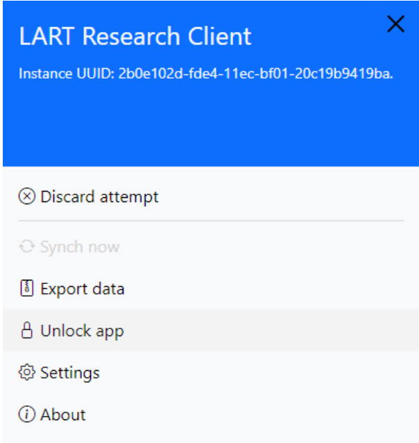
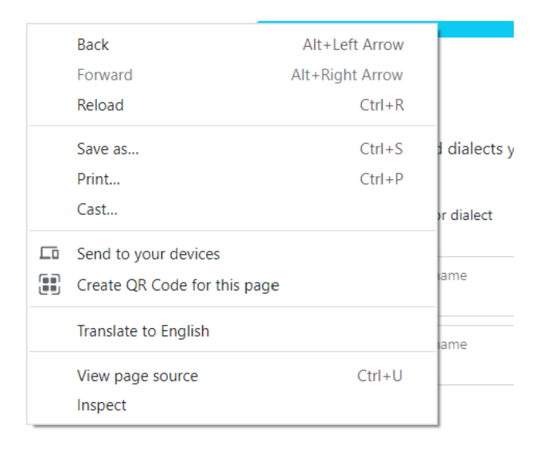

Locking and unlocking the app
=============================

The app is always in a “locked” state when it is first started. The locked state prevents the user from (accidentally or purposely) carrying out certain actions,
such as inspecting the logic behind the forms they see or using right-click context menus to reload or revert to an earlier screen. 

Done unintentionally, this could lead to invalid, corrupted, or duplicate responses, and/or might give the participants information about the administered tasks
that the researchers might not want them to have (at the point of data collection).

Researchers might find it useful however to unlock the app and access such functionality from time to time. For example to go back to the previous screen if
an error was inadvertently made, or to reload the current screen if for any reason something isn’t rendered correctly. Unlocking the app is also useful for
researchers who develop new localisations of a task (see **[INSERT LINK]**). 

.. // once localisation link is available

      Figure 16 - Open the sidebar to unlock the app

To unlock the app, open the side menu and click :guilabel:`Unlock app`. After unlocking the app, right click and these options (as well as a few more) will be available to you.
If intervening during data collection, it is good practice to lock the app again once the necessary intervention has been carried out. **Do this by following the same
steps as for unlocking.**

      
      Figure 17 - Right click will reveal options available after unlocking the app