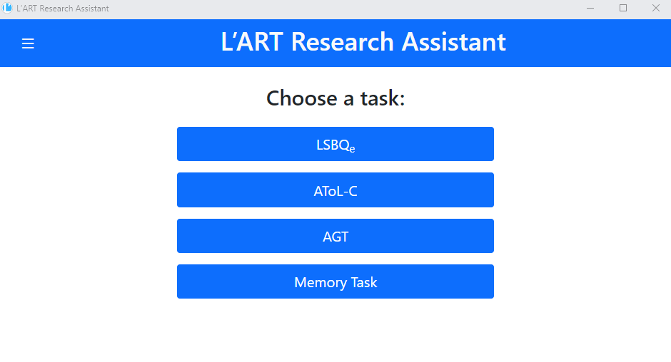
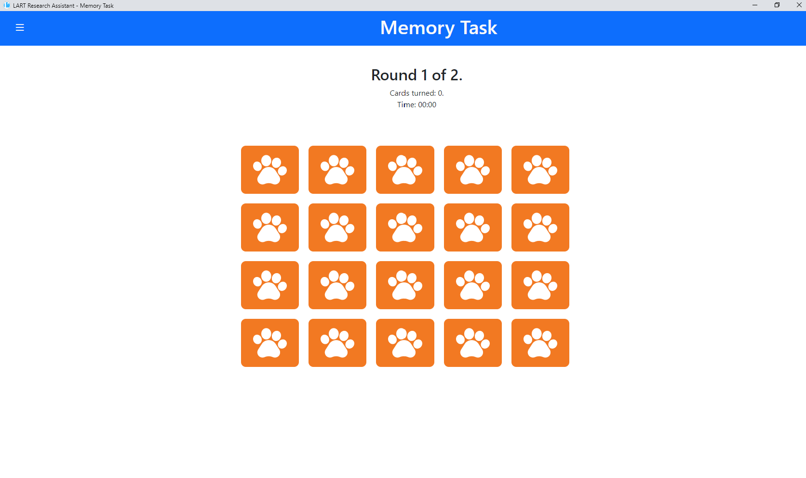
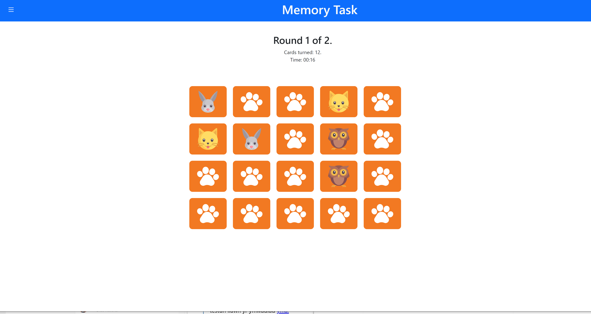
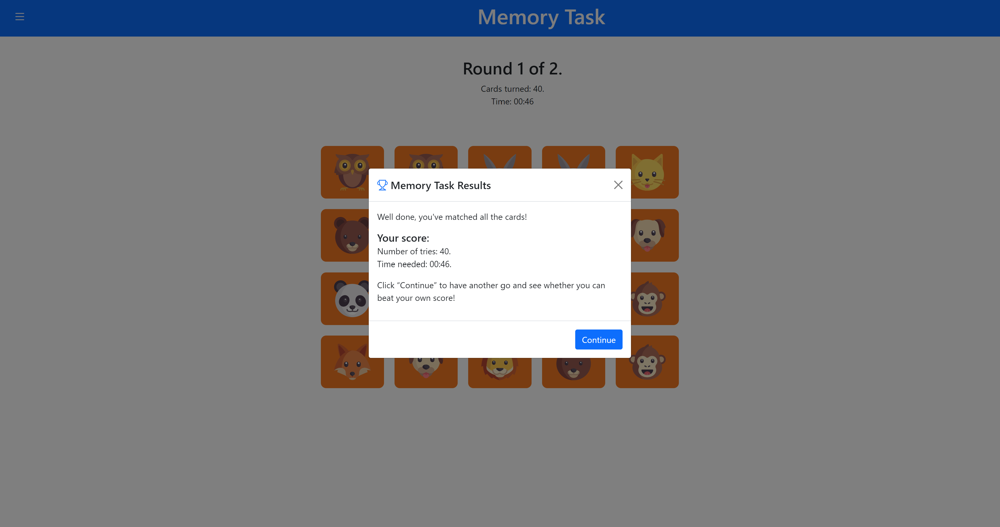
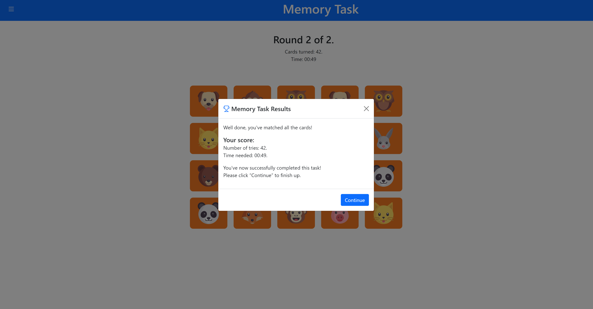

Memory game
-----------

For the purpose of not disclosing to participants that language attitudes are being measured, a memory game was implemented to act as a distractor
after the completion of linguistic tasks such as the LSBQe and AToL.  

    Research Client homescreen 

The memory game consists of 20 picture cards in which participants are tasked to match each card with its respective pair in the shortest amount of time possible.
Once a card has been clicked, only then the timer will begin.  

    Starting screen of memory game 

As seen in :numref:`memory_task_1`, all cards are faced down. Only two cards are able to be revealed at a time,
therefore the participant has to try and memorise the card locations.

    Matching identical card pairs in the memory task

There are a total of two rounds in which the participant is given the opportunity to achieve a higher score.

After completing the memory task, a congratulatory results screen will appear on the screen. As this is purely
a distractor task, results will be displayed after each round as seen in :numref:`memory_task_first_results`
and :numref:`memory_task_second_results`

    Overall results screen after completing the memory task

After the completion of the memory task, a conclusion screen will appear informing the participant that data has
been saved (see figure X). 

.. figure:: figures-mt/memory_task_conclusion
    :name: mmemory_task_conclusion
    :width: 600
    :alt: Screenshot of memory task conclusion screen

    Memory task conclusion screen

