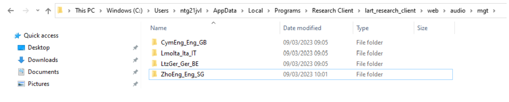
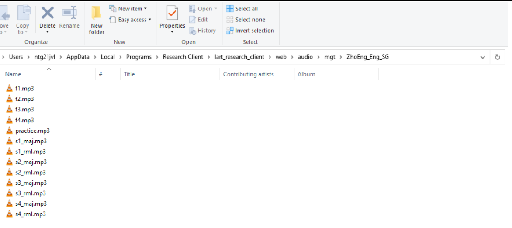
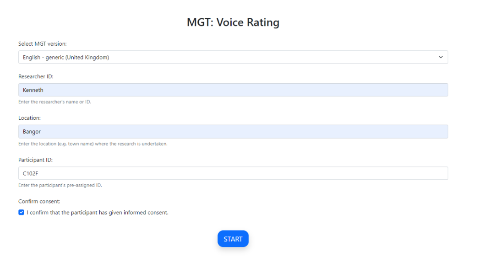
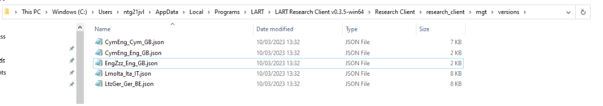
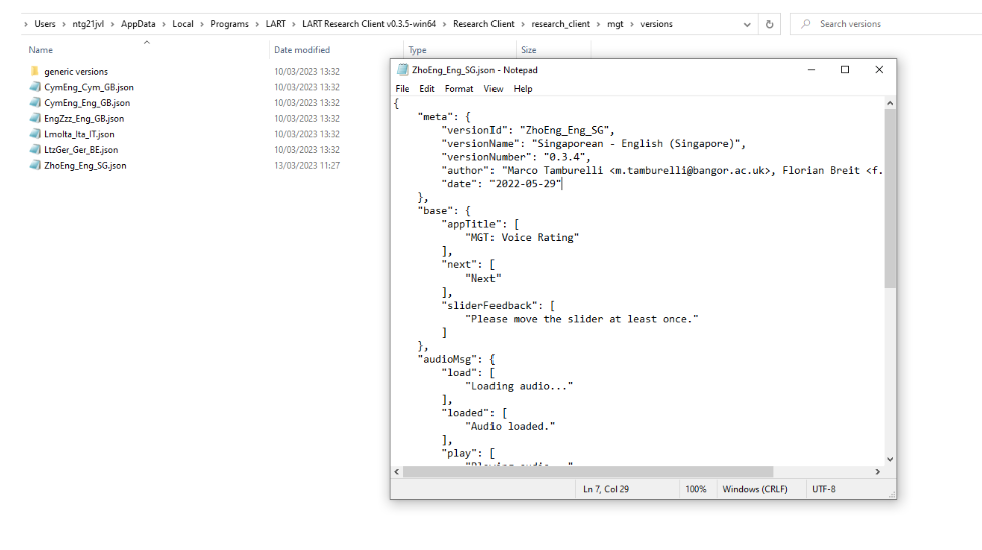

Research task: AGT
===================

The Audio Guise Tool (AGT) allows users to run either a Matched Guise Technique (MGT; [Lambert-Hodsgon-EtAl-1960]_) or a Verbal Guise Technique (VGT; [Markel-EtAl-1967]_) (see [Breit-Tamburelli-EtAl-2023]_ for details).

Differentiation between MGT or VGT is executed via your audio recordings, and it is explained in some detail below.

Loading recordings for the AGT
------------------------------

The AGT requires **thirteen** recordings in order to function. Eight recordings are classed as experimental recordings, four are classed as filler recordings and one is a practice recording.

For an MGT setup, you **must** load eight experimental recordings from four speakers, with each speaker providing a recording in either language variety.

For a VGT setup, you would load eight experimental recordings from eight speakers, with four speakers providing a recording in one language variety, and the other four speakers providing a recording in the other language variety.

What to do with the four fillers is left up to you. For instance, in an MGT setup, continuity with experimental stimuli may be preferred, so the four fillers could be recorded by two speakers, with both speakers providing a recording in each language variety.

The practice guise is presented first during an AGT and allows the participant to familiarise themselves with an AGT without testing experimental stimuli. Practice stimulus design is decided by the researcher, for instance,
you may wish to produce a recording of yourself talking about a neutral topic for the same length as the experimental and filler recordings.

Sound files must be labelled appropriately in order for the AGT to execute the audio correctly. The audio recording for the practice guise **must** be named “practice.mp3”; audio files for fillers **must** be named beginning with “f”  plus the number of the filler (i.e., f1.mp3 to f4.mp3);
and experimental guises **must** be marked “s” plus number to denote your speaker, then underscored before either “maj” or “rml” to mark the different language varieties (see :numref:`agt_sound_file_names`).

These labels must be assigned **consistently** to the file names, but it does not matter which variety you choose to label "maj" and which "rml" (though if working with a majority language and a regional/minority language it may help analysis if you use "maj" for majority and "rml" for minority language).
What matters for app functionality is that you assign the “maj” label to one language/variety and the “rml” label to the other, keeping it consistent throughout your set-up.

In the example below in :numref:`agt_folder_iso_standard_code_sequence`, :file:`“maj”` indicates Chinese recordings and :file:`“rml”` indicates English recordings. Do note that this is done **consistently** for all recordings.

.. warning::
      File names are **case-sensitive** and **must** be written identically to how they appear here in order for the AGT to function.  
      
      All sound files must be in mp3 format for the AGT to function. 

To load your own recordings for the AGT, open the folder :file:`[mgt]` by following the path below: 

:file:`C:\\Users\\username\\AppData\\Local\\Programs\\LART\\ResearchClient\\lart_research_client\\web\\audio\\agt`

Create a new folder which follows the ISO standard code sequence (see the note `here <file:///C:/Users/admin/Documents/lart-research-client/docs/build/html/tutorials/localisation-translations.html#id5>`_ for standard code sequence generating) to store the sound files for your AGT. For example, for an AGT set-up to work with Chinese-English bilinguals in Singapore
and use English as the language of presentation, you would create a folder called :file:`“ZhoEng_Eng_SG”`, as follows: 

      New folder **ZhoEng_Eng_SG** created following the ISO standard code sequence

Inside your folder, paste your own sound files but copy the standard code sequence described as above for file names when naming your sound files. 

      Sound file names for AGT following the standard code sequence

Your files will now play when you start the AGT and select your AGT version on the start menu.

**insert screenshot once agt version has been implemented in the app**

Loading a generic version of the AGT
------------------------------------

Similarly to the LSBQe (`here <file:///C:/Users/admin/Documents/lart-research-client/docs/build/html/users/research-task-lsbqe.html>`_) and AToL (`here <file:///C:/Users/admin/Documents/lart-research-client/docs/build/html/users/research-task-atol.html>`_) an "English-generic" version of the AGT is made available.
Select the generic version of the AGT by selecting the “English – generic (United Kingdom)” version from the LSBQe version drop down list.

      Loading a generic version of the AGT

Customizing a generic version of the AGT
----------------------------------------

You may wish to customize a generic version of the AGT if you would like the AGT home screen to list a specific language pair to use during your study.
There are several generic versions available (e.g., English, German, Italian), all of which can be customized. Generic versions can be identified by the fact that 
the file name contains the sequence [Zzz], a placeholder code for "unknown language" (for example, the file for the generic version for British English is called :file:`[EngZzz_Eng_GB]`).

If you wish to customise a generic version of the AGT, open the relevant file (e.g. :file:`[EngZzz_Eng_GB]` for British English, or :file:`[GerZzz_Ger_DE]` for German, and so on)
by following the path below:

:guilabel:`C:\\Users\\username\\AppData\\Local\\Programs\\LART\\Research Client\\research_client\\agt\\versions`

.. the file path above might need changing 

      File path and AGT version files

Firstly, you **must** ensure that you **save as**, following the `ISO standard code sequence <file:///C:/Users/admin/Documents/lart-research-client/docs/build/html/tutorials/localisation-translations.html#id5>`_ for standard code sequence generating).

Secondly, you must change the **“versionID”** and **“versionName”** to reflect your customization. Your **“versionID”** should match your file name. 

:numref:`agt_new_file_ZhoEng` follows the same example presented in :numref:`lsbqe_new_file_EngGle`

      New AGT file ZhoEng_Eng_SG 

It is not mandatory to include English as one of the languages on the “English – generic” AGT version. For example, if you are a dialectologist who requires a VGT to study Ulster Scots and Irish in Northern Ireland, you would call your file :file:`[ScoGle_Eng_GB]` and apply the changes to versionName and VersionID as above.

.. note::
    Note that the third label in the file name :file:`[ScoGle_Eng_GB]` remains “Eng”, as this refers to the language in which the AGT is presented, which in this case is still English. 

Seeing as no language names are mentioned anywhere in the AGT, the only other component where the languages you choose to study are important is the recordings you load onto the AGT (see `here <file:///C:/Users/admin/Documents/lart-research-client/docs/build/html/users/research-task-agt.html#loading-recordings-for-the-agt>`_). 
Everything else can remain the same as in the “English – generic” version. 
