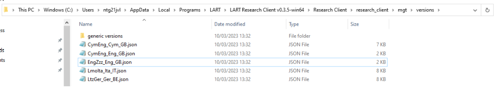

Research task: AGT
===================

The Audio Guise Tool (AGT) allows users to run either a Matched Guise Technique (MGT; Lambert, Hodsgon, Gardner & Fillenbaum 1960) or a Verbal Guise Technique (VGT; Markel, Eisler & Reese 1967) (see Breit et al., 2023 for detail). 

Differentiation between MGT or VGT is executed via your audio recordings.

Loading recordings for the AGT
------------------------------

Firstly, the AGT requires **thirteen** recordings in order to function. Eight recordings are classed as experimental recordings, four are classed as filler recordings and one is a practice recording.

For an MGT setup, you **must** load eight experimental recordings from four speakers, with each speaker providing a recording in either language variety.

For a VGT setup, you would load eight experimental recordings from eight speakers, with four speakers providing a recording in one language variety, and the other four speakers providing a recording in the other language variety.

What to do with the four fillers are left up to the researcher. For instance, in an MGT setup, continuity with experimental stimuli may be preferred, so the four fillers could be recorded by two speakers, with both speakers providing
a recording in each language variety.

The practice guise is presented first during an AGT and allows the participant to familiarise themselves with an AGT without testing experimental stimuli. Practice stimulus design is decided by the researcher, for instance,
you may wish to produce a recording of yourself talking about a neutral topic for the same length as the experimental and filler recordings.

Sounds files must be labelled appropriately in order for the AGT to execute the audio correctly. The audio recording for the practice guise must be named “practice.mp3”; audio files for fillers must be named beginning with “f”  plus the number of the filler (i.e., );
and experimental guises must be marked “s” plus number to denote your speaker, then underscored before either “maj” or “rml” denoting the language variety.

These are labels that must be assigned on the file names relating to the respective language varieties of AGT recordings. It is the researcher’s decision which language they assign the “maj” label to, and which language they assign the “rml” label to.

Language variety should be consistent for all speaker recordings. In the example below in Figure 26, :file:`“maj”` should indicate Chinese recordings and :file:`“rml”` should indicate English recordings **consistently**.

.. warning::
      File names are **case-sensitive** and **must** be written identically to how they appear here in order for the AGT to function.  
      
      All sound files must be in mp3 format for the AGT to function. 

To load your own recordings for the AGT, firstly, open the folder :file:`[mgt]` by following the path below: 

:guilabel:`C:\Users\username\AppData\Local\Programs\LART\ResearchClient\lart_research_client\web\audio\agt`

Create a new folder which follows the ISO standard code sequence (see XX for standard code sequence generating) to store the sound files for your AGT. For example, for an AGT set-up to work with Chinese-English bilinguals in Singapore
and use English as the language of presentation, you would create a folder called :file:`“ZhoEng_Eng_SG”`, as follows: 

      Figure 26 - New folder **ZhoEng_Eng_SG** created following the ISO standard code sequence

Inside your folder, paste your own sound files but copy the standard code sequence described as above for file names for naming your sound files. 

      Figure 27 - Sound file names for AGT following the standard code sequence

Your files should now be played when you start the AGT and select the desired AGT version on the start menu.

**insert screenshot once agt version has been implemented in the app**

Loading a generic version of the AGT
------------------------------------

similar to the LSBQe (link to 1.5.1) and AToL (link 1.6.1) an "English-generic" version of the AGT is made available.
Select the generic version of the AGT by selecting the “English – generic (United Kingdom)” version from the LSBQe version drop down list.

.. figure:: figures/figure28.png
      :width: 400
      :alt: Screenshot of loading a generic version of the AGT

      Figure 28 - Loading a generic version of the AGT

Customizing a generic version of the AGT
----------------------------------------

You may wish to customize a generic version of the AGT if you would like the AGT to present a specific language pair to use during your study.

In order to customize a version of the AGT, open the file :file:`[EngZzz_Eng_GB]` by following the path below: 

:guilabel:`C:\Users\username\AppData\Local\Programs\LART\Research Client\research_client\agt\versions`

.. the file path above might need changing 

      Figure 29 - File path and AGT version files

Firstly, you must **save your file as**, following the ISO standard code sequence (see **XX for standard code sequence generating**).

Secondly, you must change the **“versionID”** and **“versionName”** to reflect your customization. Your **“versionID”** should match your file name. 

Figure 29 follows the same example presented in 1.7.1. (link or add numbers to each title)

      Figure 30 -  New AGT file ZhoEng_Eng_SG 

It is not mandatory to include English as one of the languages on the “English – generic” AGT version. For example, if you are a dialectologist who requires a VGT to study Ulster Scots and Irish in Northern Ireland,
you would call your file :file:`[ScoGle_Eng_GB]` and apply the changes to versionName and VersionID as above.

Seeing as no language names are mentioned anywhere in the AGT, the only other component where the languages you choose to study are important is the recordings you load onto the AGT (see section 1.8.1). 
Everything else can remain the same as in the “English – generic” version. 