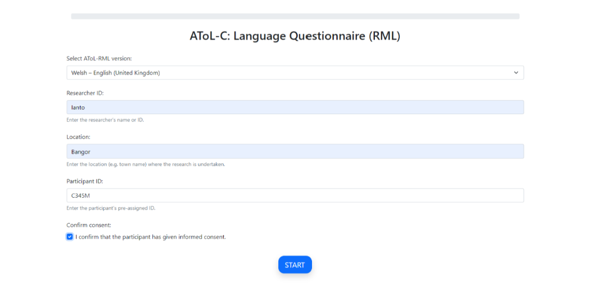
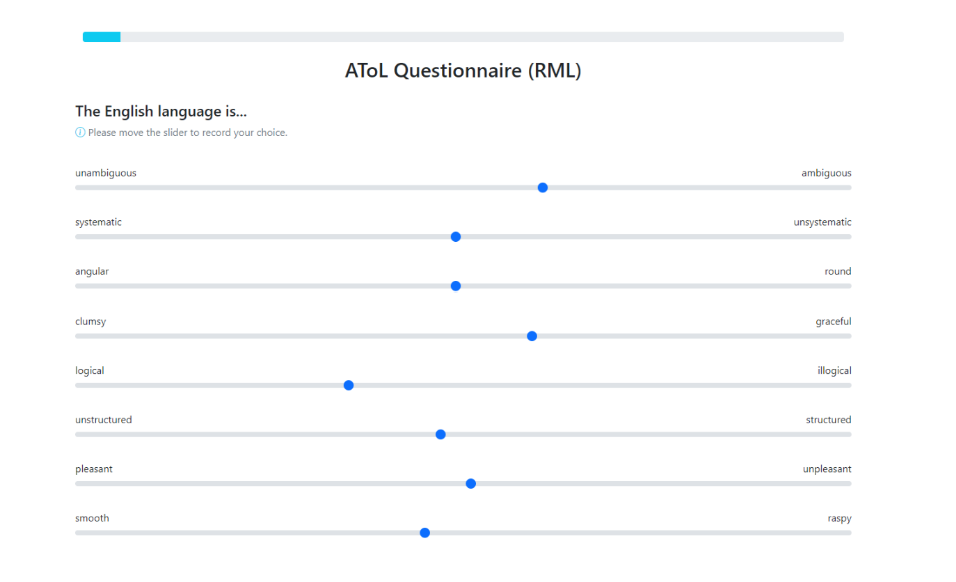
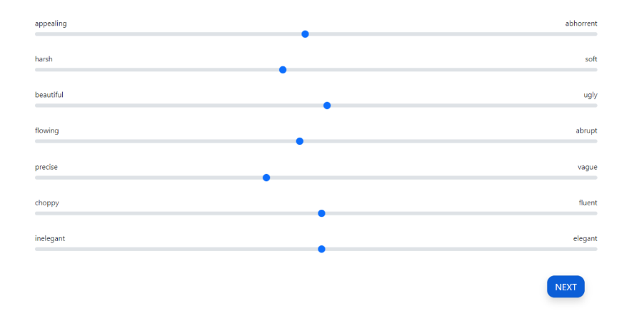
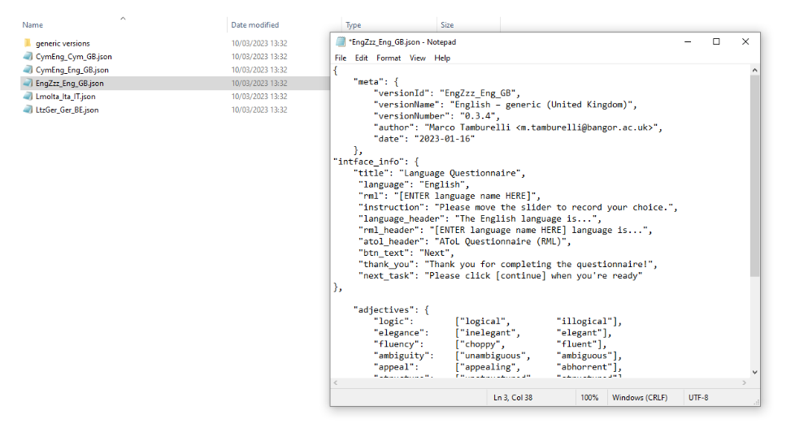

Research task: AToL
===================

The AToL begins with a start screen akin to the one in **(1.4)** where you must select a version, input Researcher ID, Location, Participant ID
and confirm that consent has been obtained by ticking the relevant box.

You will not be able to advance without completing each respective part of the start screen (see Figure 16).  

      Figure 21 - AToL Start Screen

The next screen asks the participant to rate the relevant languages, depending on the AToL version selected.

The majority language always appears first due to sociolinguistic plausibility, for instance, because all
instructions appear in the majority language in the original AToL versions for the LART research client app.

The bipolar adjective pairs are always generated in a random order. The AToL presents the statement “The language is…” followed by the AToL’s bipolar adjective pairs
which are rated by using the sliders as mentioned in 1.4.1. The AToL is a task that involves exclusively using sliders, and the order of the adjective pairs is randomised
for each participant. 

For ease of analysis, your result file for a given participant (see section ???) reports the order in which the adjectives were presented for that participant. 

      Figure 22 - AToL rating

After activating each slider and providing a rating along each bipolar adjective pair, the next button activates in a darker shade of blue, indicating that you may advance to the next part of the AToL.

      Figure 23 - Completed AToL section with an activated "next" button

Loading and customizing a generic version of the AToL
-----------------------------------------------------

As for the LSBQe (1.5.1), an "English-generic" version of the AToL is made available. Unlike the LSBQe however, it is not possible to load a generic version of the AToL without customizing it.

This is due to the fact that while the LSBQe may refer to “the other language”, the AToL is dependent on naming each language under investigation at the top of every page (see for example figure 20).

      Figure 24 - Generic AToL file EngZzz_Eng_GB

Firstly, as in **1.5.2**??, you must open the generic file and “save as” in order to make a copy ready for customisation. After that, change the “versionID” and “versionName” to reflect your customization.

.. ask about 1.5.2

After that, change the “versionID” and “versionName” to reflect your customization. Following the English and Scots example presented **here (insert link when previous section is completed** this would be :file:`[report name and ID]`

Your file name should match your “versionID”, which must follow the ISO standard code sequence (see XX for standard code sequence generating). In order to produce a customized version of the AToL,
you must also change both “rml” and “rml_header” to indicate the language(s) pertinent to your AToL version. 

      Figure 25 - New customized AToL file EngSco_Eng_GB
