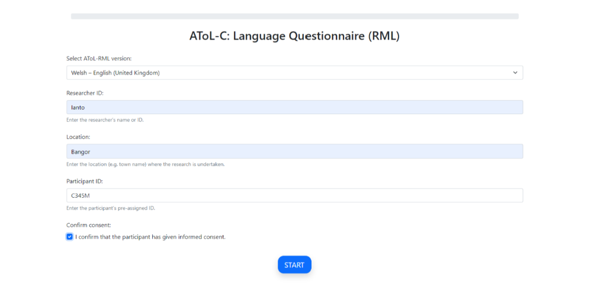
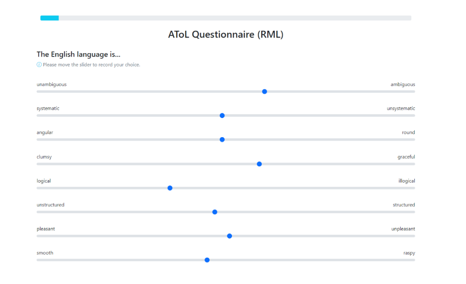
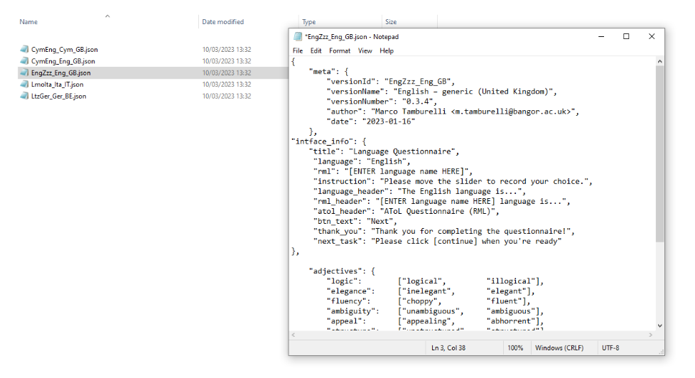
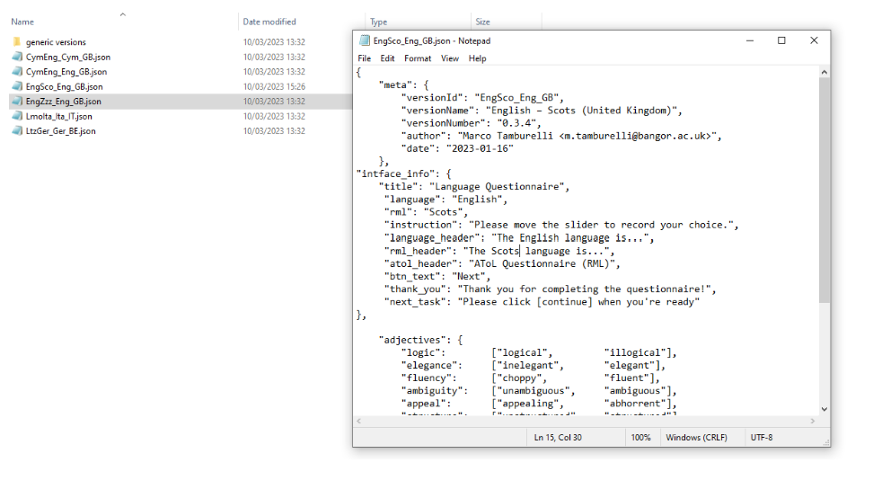

.. _AToL:

Research task: AToL
===================

The AToL begins with a start screen where you must select a version, input Researcher ID, Location, Participant ID
and confirm that consent has been obtained by ticking the relevant box.

You will not be able to advance without completing each respective part of the start screen (see :numref:`atol_start_screen`).  

      AToL Start Screen

The next screen begins the AToL proper, asking the participant to rate the relevant languages, depending on the AToL version selected.

The majority language always appears first due to sociolinguistic plausibility, for instance, because all
instructions appear in the majority language in the original AToL versions for the L'ART research Assistant.

The bipolar adjective pairs are always generated in a random order (the specific order for each participant is recorded in that participant's the data file).
The AToL presents the statement **“The X language is…”** followed by the AToL’s bipolar adjective pairs which are rated by using the sliders as seen in :numref:`atol_rating` below.

.. note::

      The AToL is a task that involves exclusively using sliders, and the order of the adjective pairs is randomised for each participant. 

For ease of analysis, your result file for a given participant (see :numref:`exporting_data_file_partic_input`) reports the order in which the adjectives were presented for that participant. 

      AToL rating

After activating each slider and providing a rating along each bipolar adjective pair, the next button activates in a darker shade of blue, indicating that you may advance to the next part of the AToL.

.. figure:: figures/atol_completed_section.png
      :name: atol_completed_section
      :width: 600
      :alt: Screenshot of completed AToL section

      Completed AToL section with an activated "next" button

Loading and customizing a generic version of the AToL
-----------------------------------------------------

As for the :ref:`LSBQe`, several generic versions of the AToL are available (e.g., English, German, Italian). 

The generic versions that are currently visible are English and Welsh. If you wish to make the German and Italian generic versions visible,
repeat the same steps as found under :ref:`making-generic-versions-visible`.

Unlike the LSBQe, however, it is not possible to load a generic version of the AToL without customizing it.

This is due to the fact that while the LSBQe may refer to “the other language”, the AToL is dependent on naming each language under investigation at the top of every page (see :numref:`atol_rating`"the English Language is...")

      Generic AToL file EngZzz_Eng_GB

Firstly, as with the :doc:`LSBQe <research-task-lsbqe>`, you must open the generic file and click :guilabel:`Save as`` in order to make a copy ready for customisation.

.. note::
      Generic versions can be identified by the fact that the file name contains the sequence [Zzz], a placeholder code for "unknown language"
      (for example, the file for the generic version for British English is called :file:`EngZzz_Eng_GB`).

After that, change the :code:`version_id`` and :code:`version_name` to reflect your customization. Following the English and Scots example presented in the :ref:`LSBQe <LSBQe>`, this would be :file:`EngSco_Eng_GB`

Your file name should match your :code:`version_id`, which must follow the ISO standard code sequence (see :ref:`localisation` for standard code sequencing)

In order to produce a customized version of the AToL, you must also change both :py:mod:`rml` and :py:mod:`rml_header` to indicate the language(s) pertinent to your AToL version. 

      New customized AToL file EngSco_Eng_GB

