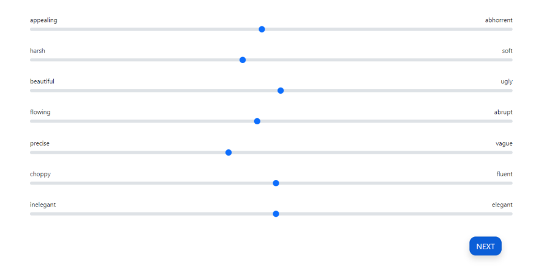
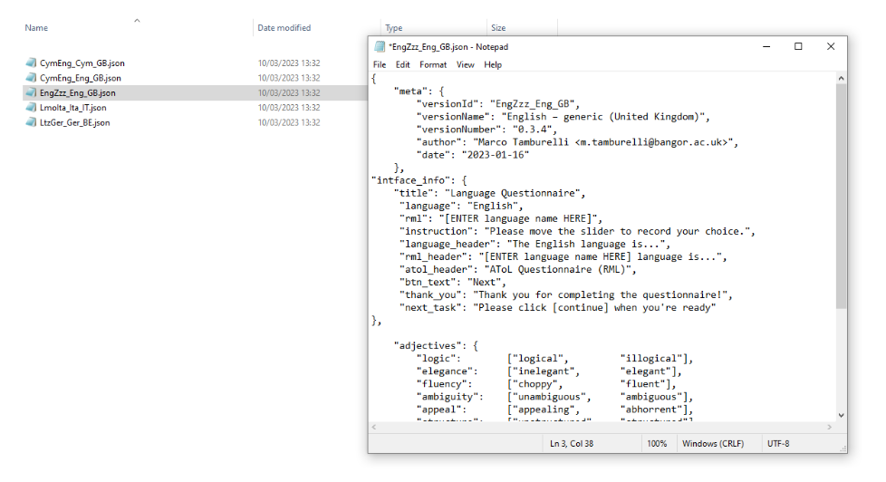

Research task: AToL
===================

The AToL begins with a start screen where you must select a version, input Researcher ID, Location, Participant ID
and confirm that consent has been obtained by ticking the relevant box.

You will not be able to advance without completing each respective part of the start screen **(see Figure ////)**.  

.. figure:: figures/atol-start-screen.png
      :width: 600
      :alt: Screenshot of AToL Start Screen

      AToL Start Screen

The next screen begins the AToL proper, asking the participant to rate the relevant languages, depending on the AToL version selected.

The majority language always appears first due to sociolinguistic plausibility, for instance, because all
instructions appear in the majority language in the original AToL versions for the L'ART research client app.

The bipolar adjective pairs are always generated in a random order (the specific order for each participant is recorded in that participant's the data file). The AToL presents the statement **“The X language is…”** followed by the AToL’s bipolar adjective pairs
which are rated by using the sliders as seen in Figure 43 below.

.. note::
The AToL is a task that involves exclusively using sliders, and the order of the adjective pairs is randomised for each participant. 

For ease of analysis, your result file for a given participant **(see Figure //** `here <file:///C:/Users/admin/Documents/lart-research-client/docs/build/html/users/exporting-data.html#id8>`_) reports the order in which the adjectives were presented for that participant. 

.. figure:: figures/atol-rating.png
      :width: 600
      :alt: Screenshot of AToL rating

      AToL rating

After activating each slider and providing a rating along each bipolar adjective pair, the next button activates in a darker shade of blue, indicating that you may advance to the next part of the AToL.

      Completed AToL section with an activated "next" button

Loading and customizing a generic version of the AToL
-----------------------------------------------------

As for the `LSBQe, <file:///C:/Users/admin/Documents/lart-research-client/docs/build/html/users/research-task-lsbqe.html>`_ several generic versions of the AToL are available 
(e.g., English, German, Italian).
Unlike the LSBQe, however, it is not possible to load a generic version of the AToL without customizing it.

This is due to the fact that while the LSBQe may refer to “the other language”, the AToL is dependent on naming each language under investigation at the top of every page (see `Figure //// <file:///C:/Users/admin/Documents/lart-research-client/docs/build/html/users/research-task-atol.html#id2>`_ "the **English** Language is...")

      Generic AToL file EngZzz_Eng_GB

Firstly, as seen in `Figure /// <file:///C:/Users/admin/Documents/lart-research-client/docs/build/html/users/research-task-lsbqe.html#id3>`_ you must open the generic file and **“save as”** in order to make a copy ready for customisation.

.. note::
      Generic versions can be identified by the fact that the file name contains the sequence [Zzz], a placeholder code for "unknown language"
      (for example, the file for the generic version for British English is called :file:`[EngZzz_Eng_GB]`).

After that, change the “versionID” and “versionName” to reflect your customization. Following the English and Scots example presented `here <file:///C:/Users/admin/Documents/lart-research-client/docs/build/html/users/research-task-lsbqe.html#id8>`_, this would be :file:`[EngSco_Eng_GB]`

Your file name should match your “versionID”, which must follow the ISO standard code sequence (see the note )

.. (see XX for standard code sequence generating > add in localisation link once section has been completed). 

In order to produce a customized version of the AToL, you must also change both “rml” and “rml_header” to indicate the language(s) pertinent to your AToL version. 

.. figure:: figures/atol-new-customized-file.png
      :width: 600
      :alt: Screenshot of a customized AToL file 

      New customized AToL file EngSco_Eng_GB
