.. _LSBQe:

Research task: LSBQe
====================

In the LSBQe, the task start screen is followed by the three main sections of the LSBQe on Language and Social Background,
Language and Dialect Background, and Community Language Use Behaviour respectively. 

For more details on the contents of the LSBQe and how this differs from the standard version of the LSBQe, see [Breit-Tamburelli-EtAl-2023]_.

Any mandatory fields that haven’t been completed by the participant will be flagged up if the user attempts to continue
to the next page without having fully completed any section of the LSBQe or the response entered in a field is invalid 
(e.g. text entered in a field expecting a date). 

The user is given instructions on how they should complete the missing fields if this happens. 

For researchers using the app, or a specific localisation of the LSBQe for the first time, it might be useful to complete 
the LSBQe and purposely leave all fields blank before trying to submit so they can read through and familiarise themselves
with the user-feedback provided for each field.  

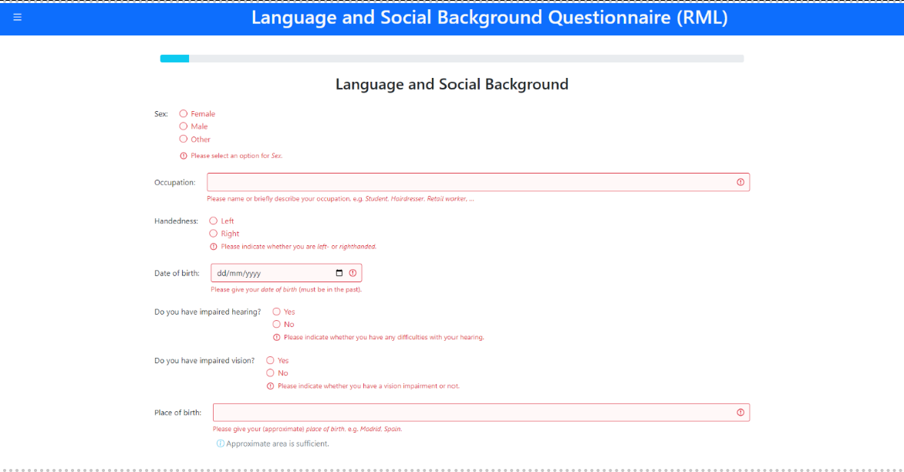

      Mandatory fields that remain unanswered or contain invalid input will be flagged in red

.. figure "15" will be merged with app presentation

.. _making-generic-versions-visible:

Loading a generic version of the LSBQe
--------------------------------------
Several generic versions of the LSBQe (e.g., English, German, Italian) are available for you to use if the languages pertinent to your research
location are not available amongst our four LSBQe versions, or if you prefer a generic or customisable version of the LSBQe.

The generic versions that are currently visible are English and Welsh, which can be selected from the dropdown list. For example, if you wish to 
use the generic version for British English, you would choose "English-generic (United Kingdom)".

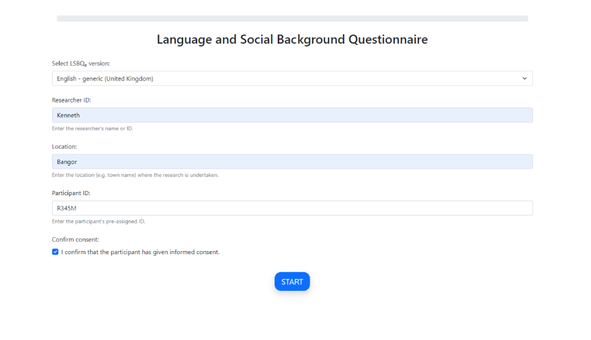

      Loading a generic version of the LSBQe

This version of the LSBQe will give you English and "Other Language" at every juncture where both languages are named.

If you wish to make the German and Italian generic versions visible, this can be done by following the path below:

:file:`C:\\Users\\admin\\Documents\\lart-research-assistant\\research_assistant\\lsbqe\\versions`

Next, choose the generic version you wish to make visible. Using the German generic version as an example,
right-click the file and remove the initial underscore (_) by selecting the :guilabel:`Rename` option as
seen in :numref:`generic_versions_renaming` below:

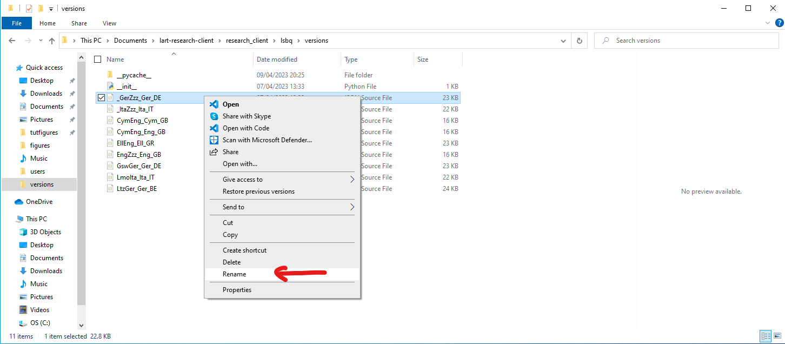

      Locating and renaming the German generic version

Once the app has been restarted, the generic version will appear in the dropdown list.

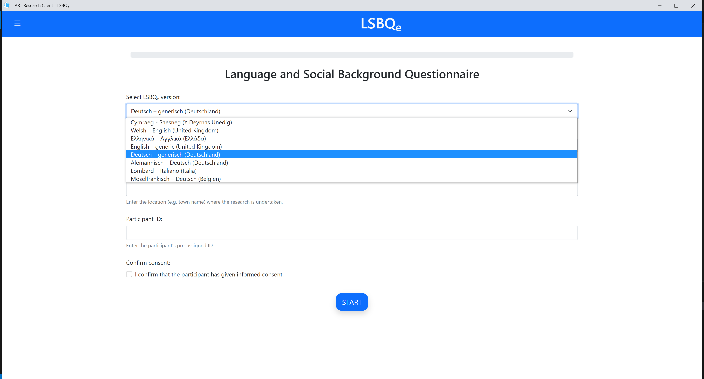

      German generic version as an available option 

Customizing a generic version of the LSBQe
------------------------------------------

You may wish to customize a generic version of the LSBQe if you would like the LSBQe to present a specific language pair to use during your study.

Generic versions can be identified by the fact that the file name contains the sequence [Zzz], a placeholder code for "unknown language" (for example, 
the file for the generic version for British English is called :file:`[EngZzz_Eng_GB]`).

If you wish to customise a generic version of the LSBQe, open the relevant file (e.g. :file:`[EngZzz_Eng_GB]` for British English, or :file:`[GerZzz_Ger_DE]` for German, and so on)
by following the path below:

:file:`C:\\Users\\username\\AppData\\Local\\Programs\\LART\\ResearchAssistant\\research_assistant\\lsbqe\\versions`

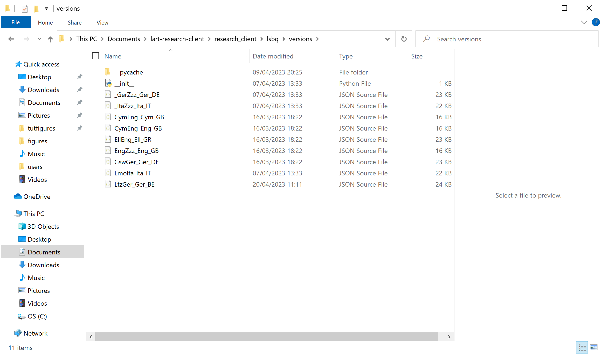

      Opening versions folder

Firstly, you **must "save as"**, following the ISO standard code sequence (see :ref:`localisation`
for standard code sequence generating) (See :numref:`tutorial_naming_conventions`)

For example, if you wish to customize a version for English and Irish for use in Ireland through the medium of English, you will create a file called
:file:`[EngGle_Eng_IE]` (see :numref:`lsbqe_saving_generic_files`).  

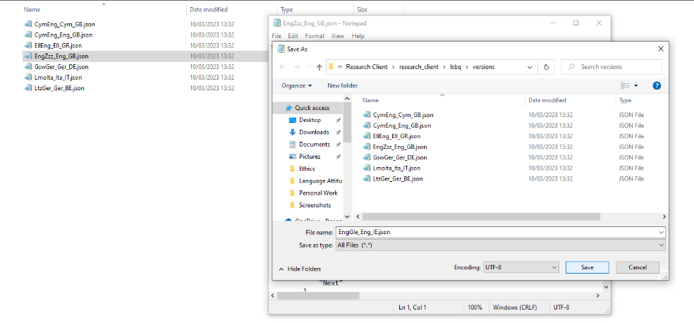

      Save the generic files as and follow the ISO code sequence

After your new version is saved, you must change the :code:`version_id` and :code:`version_name`
to reflect your customization. Your :code:`version_id` should match your file name.

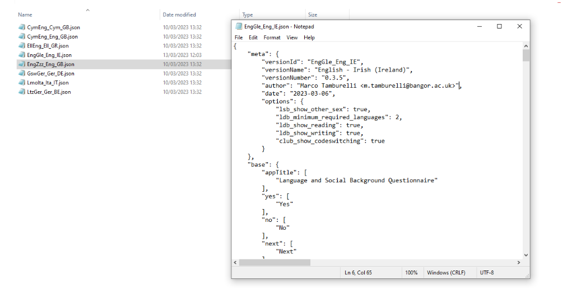

      New LSBQe file EngGle_Eng_IR

A further customization that you can make inside the file relates to how your LSBQe version will refer to the language you wish to include. 

To do this, you must search for **"RML”** in your :file:`[EngGle_Eng_IE]` and change “the other language” to the language name you wish to be displayed.
In our current example that would be **“Irish”** as shown in :numref:`lsbqe_customizing_file` below:

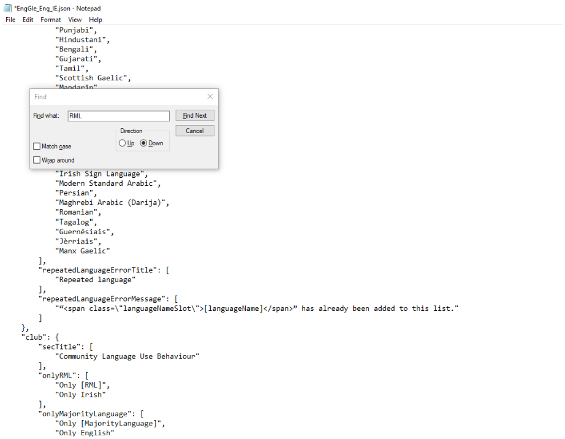

      Customizing inside your LSBQe file.

It is not mandatory to include English as one of the languages on your LSBQe version. For example, if you require an LSBQe version to study
Ulster Scots and Irish in Northern Ireland, you would call the file :file:`[ScoGle_Eng_GB]` and apply the relevant changes in :numref:`lsbqe_saving_generic_files`
and :numref:`lsbqe_new_file_EngGle` .

Additionally, in order to change the default **"English"** in the LSBQe, you would have to search :code:`MajorityLanguage`
and change each instance of "English" to "Ulster Scots" (see :numref:`lsbqe_customizing_file`)

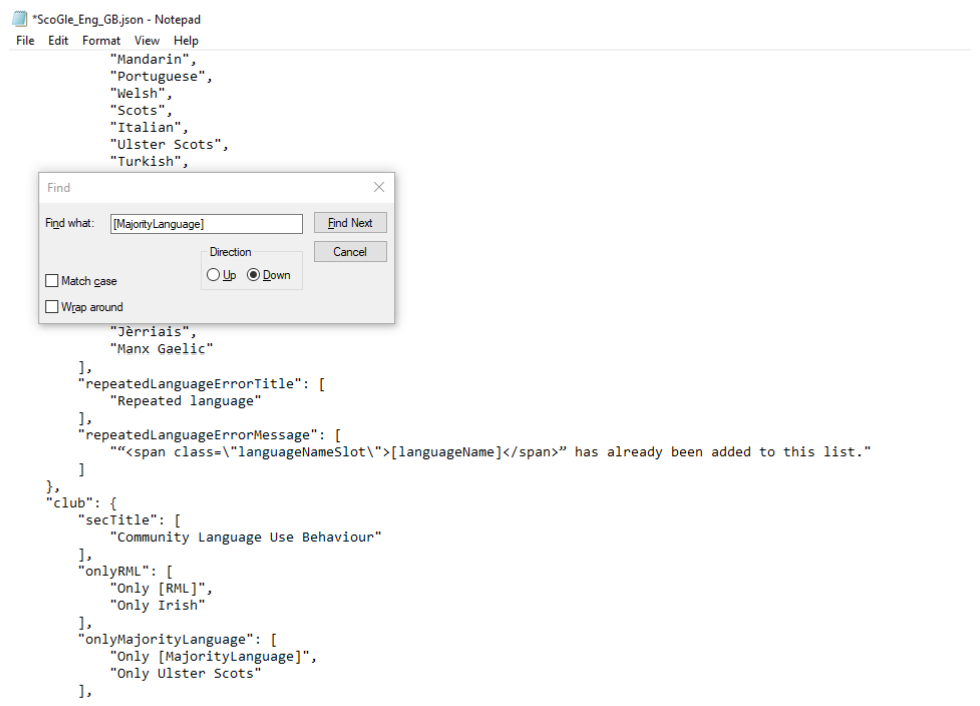

      Customizing both languages in your generic LSBQe file

.. note::
    Note that the third label in the file name :file:`[ScoGle_Eng_GB]` remains **“Eng”**, as this refers to the language in which the
    LSBQe is presented, which in this case is still English. 
    
    See :ref:`localisation` for more details on file naming and ISO codes.

Excludable Questions   
--------------------

The LSBQe allows users to include or exclude certain questions depending on the nature of the language communities to be researched
(see Breit et al. 2023 for details on the rationale behind these choices).

Below you’ll find instructions on which questions allow this option and how to go about excluding them. 

"Other" Sex
***********

As default, the LSBQe contains three options that a participant may select as their sex: “Female”; “Male”; “Other”. 

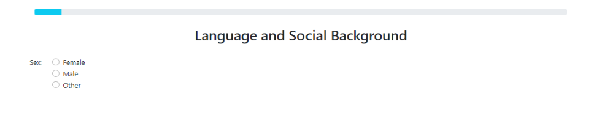

      Default options for sex on LSBQe

However, some researchers may prefer to use a binary choice (e.g., where biological sex is a research variable) and therefore exclude
“Other” from the available options. 

To do this, open your LSBQe version file from the following path:

:file:`C:\\Users\\username\\AppData\\Local\\Programs\\LART\\ResearchAssistant\\research_assistant\\lsbqe\\versions`

With the file open, you will see that below the section :py:mod:`options` the line labelled :file:`lsb_show_other_sex`` is set to :py:mod:`true`:

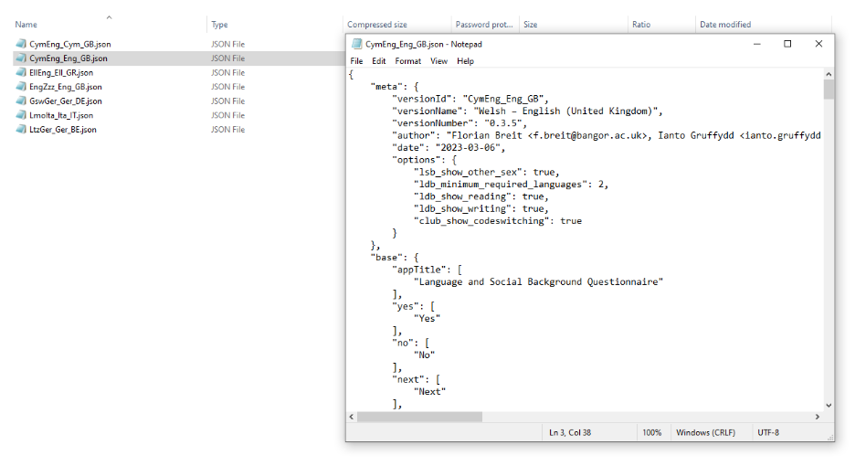

      The feature "lsb_show_other_sex" set to "true"

To exclude the :py:mod:`Other` option in your version of the LSBQe you simply need to set that option to :py:mod:`false`.

.. figure:: figures/lsbqe_show_other_sex_false.png
      :name: lsbqe_show_other_sex_false
      :width: 400
      :alt: Screenshot of the feature 'lsb_show_other_sex' set to "false"

      The feature "lsb_show_other_sex" has been changed to "false"

.. note::
      Make sure to restart the app so that the change can take effect.

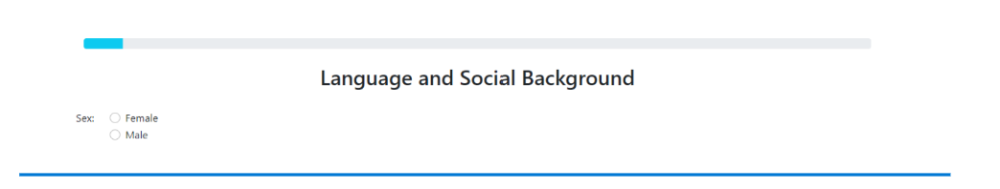

      How the question appears in the app after removing :py:mod:`Other`

If you wish to change it back to including :py:mod:`Other`, you must reverse the above procedure and change the setting back to :py:mod:`true`.

Minimum required languages
**************************

In the “Language and Dialect Background” section, the opening question asks participants to list all the languages and dialects
that they speak and give information regarding where they learned each of them, when they learned them, and if there were significant
periods where the participant did not use any of them.

By default, the LSBQe requires a minimum of two required language names, by presenting participants with two blank lines that must be filled
before continuing.

While participants have the option of adding more language varieties via the :guilabel:`Add Line` button (i.e. for participants who are multilingual),
only two lines will appear as default (see :numref:`ldb_two_min_lang`) 

.. figure:: figures/ldb_two_min_lang.png
      :name: ldb_two_min_lang
      :width: 400
      :alt: Screenshot of Language and Dialect Background section

      The opening question on the Language and Dialect Background section set to two minimum required languages

Should you wish to make three or more languages the default without having to add more lines, for instance if you’re researching trilingualism
within a community, you may set the minimum required languages to three.

To do this, firstly, open your LSBQe version file from the following path:

:file:`C:\\Users\\username\\AppData\\Local\\Programs\\LART\\ResearchAssistant\\research_assistant\\lsbqe\\versions`

With the file open, you will see that below the section :py:mod:`options` the line labelled :file:`ldb_minimum_required_languages` is set to “2”: 

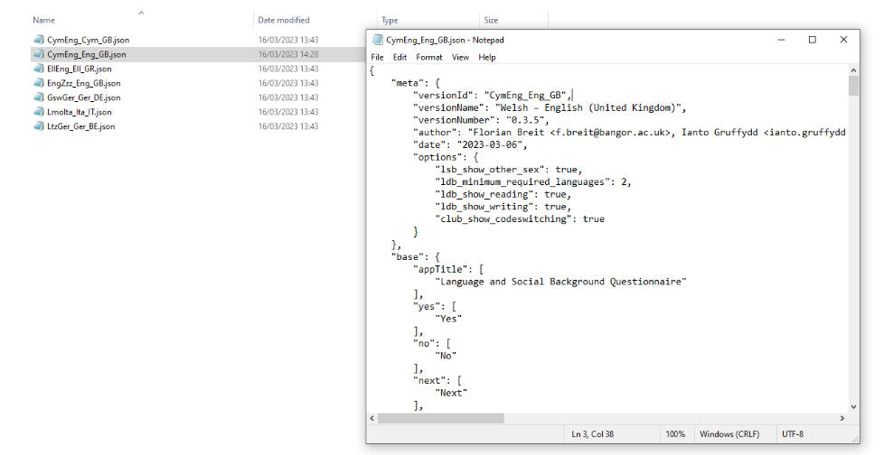

      The feature “ldb_minimum_required_languages” set to “2”   

To change this to a different number, e.g., 3, you simply type “3” in place of “2”: 

.. figure:: figures/ldb_changing_min_lang_3.png
      :name: ldb_changing_min_lang_3
      :width: 400
      :alt: Screenshot of changing the minimum required languages

      Changing the minimum required languages to three

.. note:: 
      Make sure to restart the app so that the change can take effect.

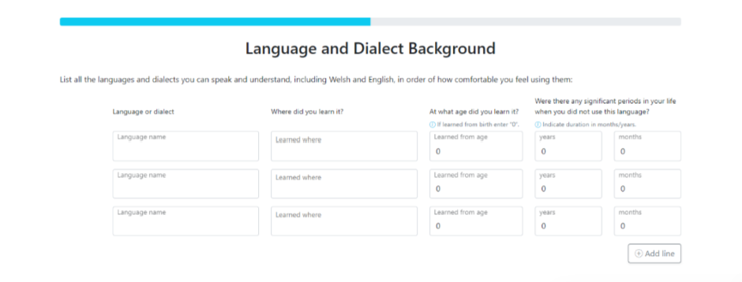

      How the question appears in the app with a minimum of three required languages
 
If you wish to change the option back to two languages, you must reverse the above procedure and change the setting back to “2”.

Reading and Writing:
********************

In the “Language and Dialect Background” section, participants are asked how much time they spend engaged in speaking,
listening, reading, and writing in each of their languages.

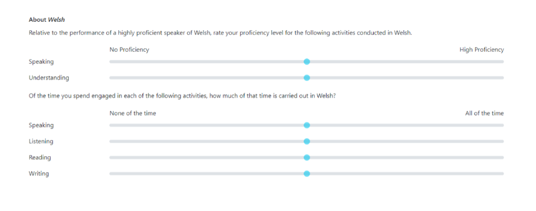

      How the question appears in the app with "Reading" and "Writing" options

The “reading” and “writing” parts of the questions can be removed. For example when researching a community whose one or more languages
is only/mostly oral or doesn’t have an accepted orthographic system, making the “reading” and “writing” options irrelevant to participants.  

To remove the “reading” and “writing” options, firstly, open your LSBQe version file from the following path:

:file:`C:\\Users\\username\\AppData\\Local\\Programs\\LART\\ResearchAssistant\\research_assistant\\lsbqe\\versions`

With the file open, you will see that below the section :py:mod:`options` the lines labelled :file:`ldb_show_reading` and :file:`ldb_show_writing`
are set to :py:mod:`true`: 

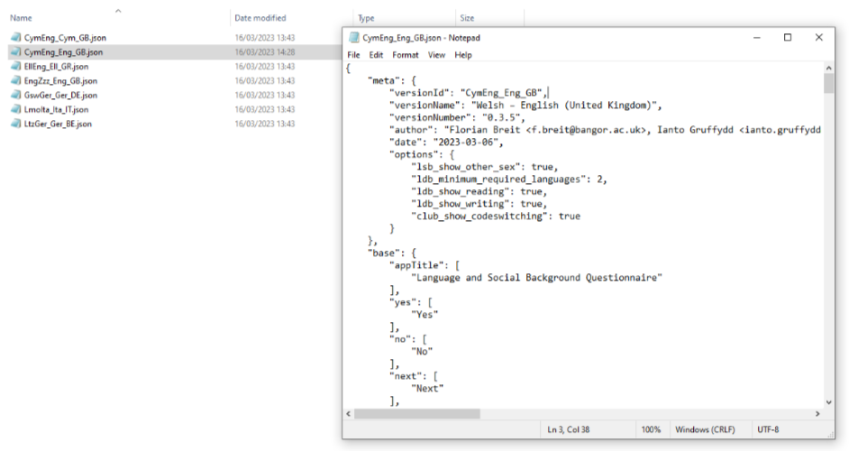

      The features “ldb_show_reading” and “ldb_show_writing” are set to “true” by default 

To exclude these options from your version of the LSBQe, simply change the values to :py:mod:`false`: 

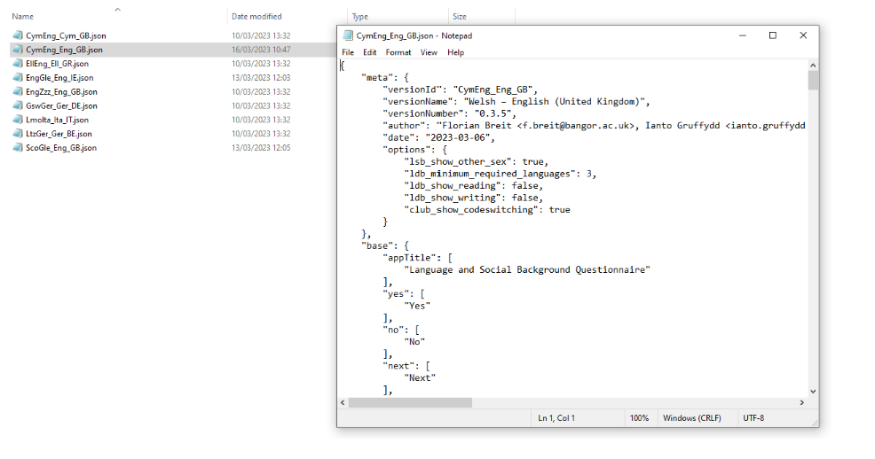

      Setting the "reading" and "writing" options to “false”

.. note::
      Make sure to restart the app so that the change can take effect.

If you wish to change it back to including “reading” and “writing”, you must reverse the process and change the values back to :py:mod:`false`.

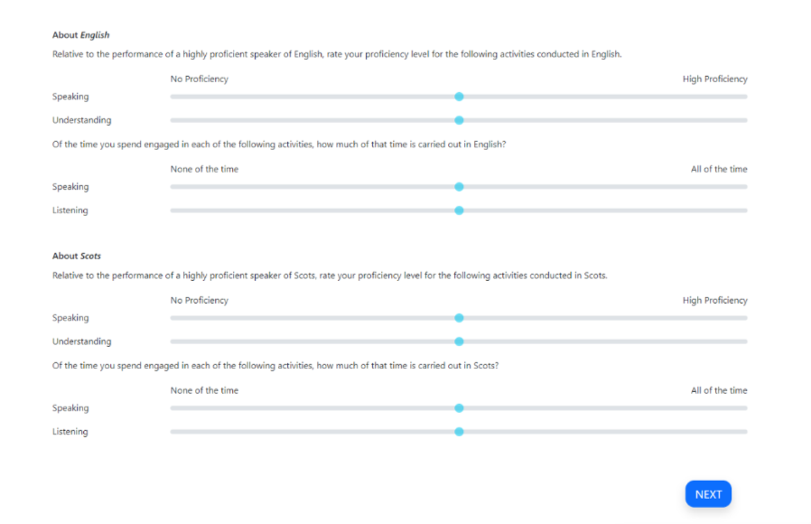

      How the question appears in the app with "reading" and "writing" options removed 

Show code-switching
*******************

The LSBQe’s Community Language Use Behaviour section contains a final section on code-switching where participants are asked how often
they code-switch in different contexts (see :numref:`club_code_switching_incl`) 

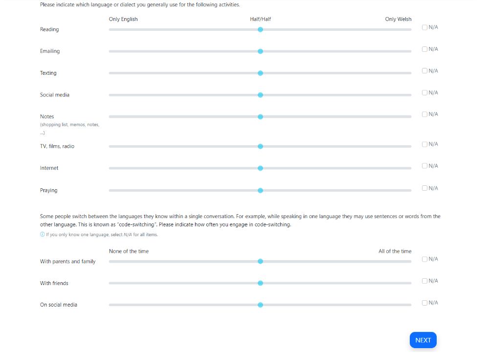

      CLUB section with code-switching question included

The code-switching question can be removed if this information is not required in your study.  

To remove the code-switching question, firstly, open your LSBQe version file from the following path: 

:file:`C:\\Users\\username\\AppData\\Local\\Programs\\LART\\ResearchAssistant\\research_assistant\\lsbqe\\versions`

With the file open, you will see that below the section :py:mod:`options` the line labelled :file:`club_show_codeswitching`` is set to
:py:mod:`true` (see :numref:`club_code_switching_true_default`)

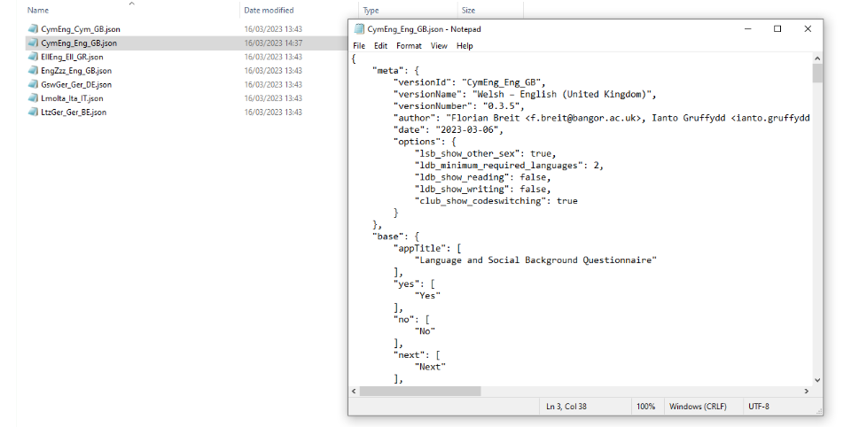

      The feature “club_show_codeswitching” is set to “true” by default

To exclude the code-switching question from your version of the LSBQe, simply change the value to :py:mod:`false`
(see :numref:`raw_code_switch_false`)

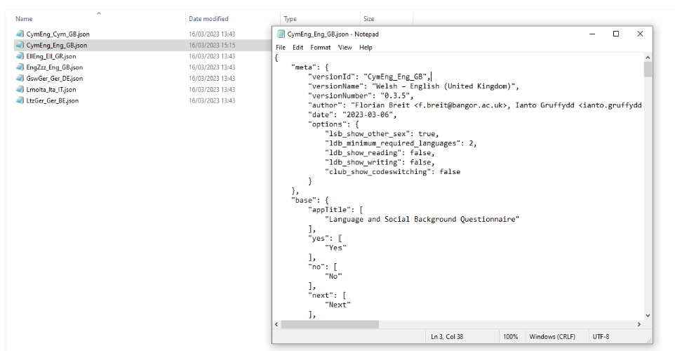

      Setting the codeswitching option to “false” 

.. note::
      Make sure to restart the app so that the change can take effect.

After removing the code-switching section, the CLUB section finishes on the question prior to the code-switching question that asks participants
to indicate which language or dialect they generally use for various activities (see :numref:`code_switching_read_write_removed`).  

If you wish to change it back to including the code-switching question, you must reverse the process and change the value back to :py:mod:`true`.

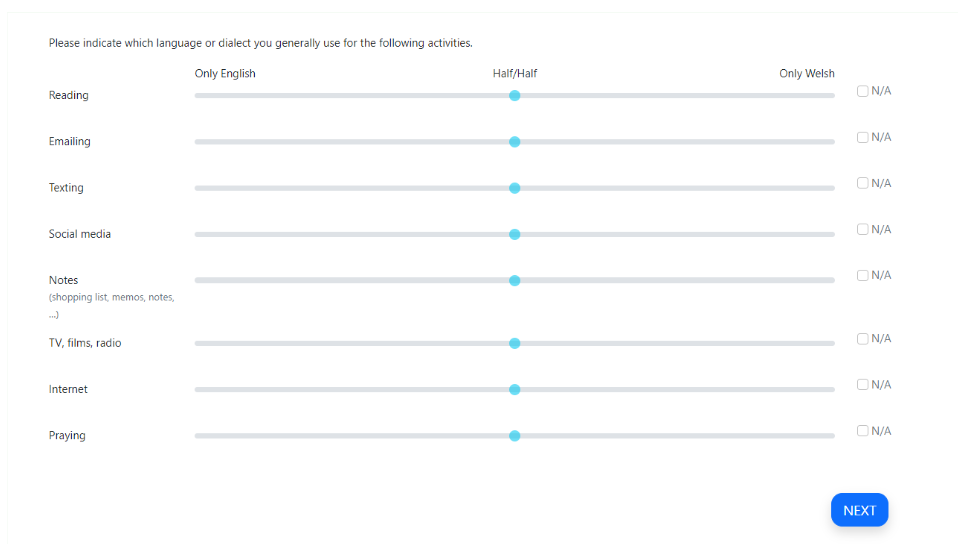

      How the question appears in the app with "reading" and "writing" options removed 

