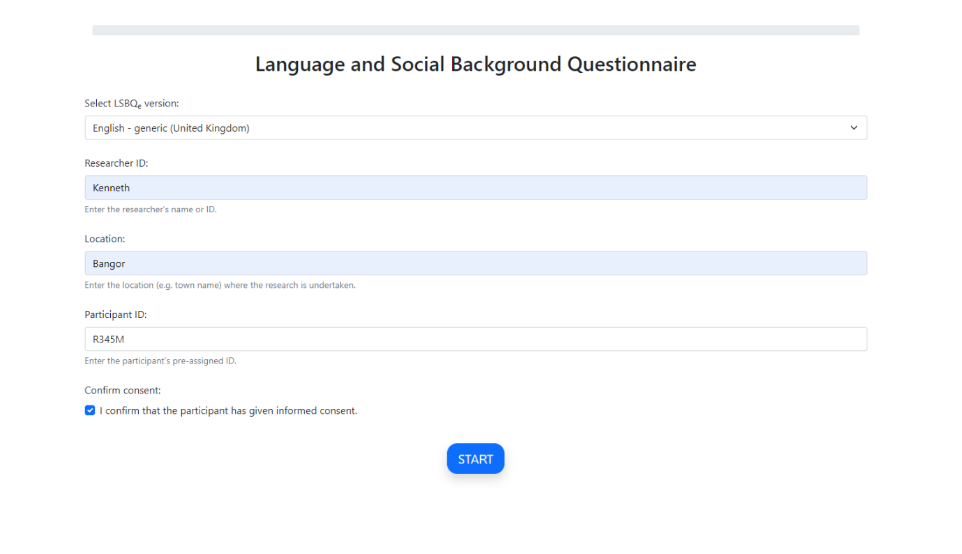
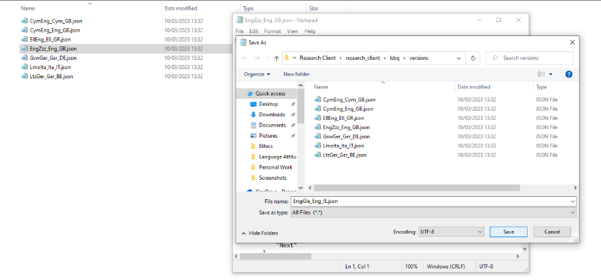
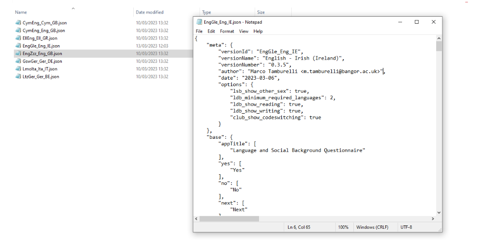
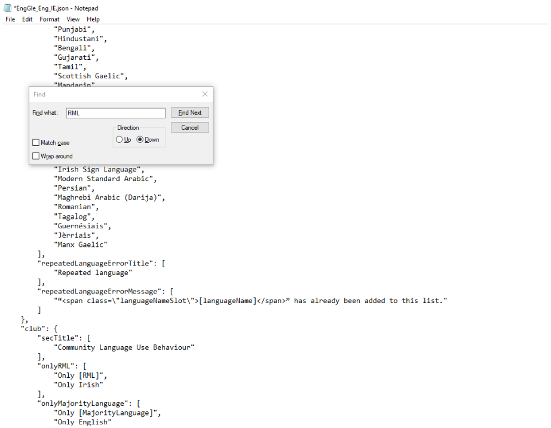
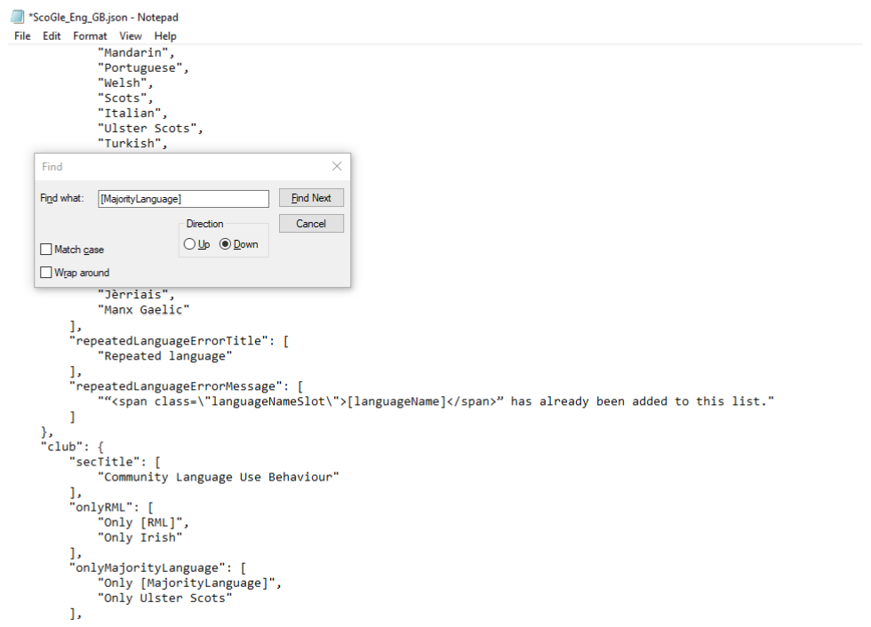

Research task: LSBQe
====================

In the LSBQe, the task start screen is followed by the three main sections of the LSBQe on Language and Social Background, Language and Dialect Background, and Community Language Use Behaviour respectively. 

For more details on the contents of the LSBQe and how this differs from the standard version of the LSBQ, see Breit et al. (2023) [INSERT LINK].  

Any mandatory fields that haven’t been completed by the participant will be flagged up if the user attempts to continue
to the next page without having fully completed any section of the LSBQe or the response entered in a field is invalid 
(e.g. text entered in a field expecting a date). 

The user is given instructions on how they should complete the missing fields if this happens. 

For researchers using the app, or a specific localisation of the LSBQe for the first time, it might be useful to complete 
the LSBQe and purposely leave all fields blank before trying to submit so they can read through and familiarise themselves
with the user-feedback provided for each field.  

.. see comment to reword

.. figure:: figures/lsbqefigure14.png
      :width: 600
      :alt: Screenshot of unanswered mandatory fields flagged in red.

      Figure 14 - Mandatory fields that remain unanswered or contain invalid input will be flagged in red

.. figure 15 will be merged with app presentation

Loading a generic version of the LSBQe
--------------------------------------

An “English – generic” version of the LSBQe is available for you to use if the languages pertinent to your research location are not available amongst our
four LSBQe versions, or if you prefer a generic or customisable version of the LSBQe.

To select the generic version of the LSBQe, choose "English-generic (United Kingdom)" from the LSBQe version drop down list.

      Figure 16 - Loading a generic version of the LSBQe

This version of the LSBQe will give you English and "Other Language" at every juncture where both languages are named. See figure **xx** below for an example. 

.. add figure once available

Customizing a generic version of the LSBQe
------------------------------------------

You may wish to customize a generic version of the LSBQe if you would like the LSBQe to present a specific language pair to use during your study.

In order to customize a version of the LSBQe, open the file :file:`[EngZzz_Eng_GB]` by following the path below:

:guilabel:`C:\Users\username\AppData\Local\Programs\LART\ResearchClient\lart_research_client\lsbq\versions`

.. insert screenshot of folder once available

Firstly, you **must** save your file as, following the ISO standard code sequence (see **XX** for standard code sequence generating) (see Figure 17).
For example, if you wish to customize a version for English and Irish for use in Ireland through the medium of English, you will create a file called
[EngGle_Eng_IE] (see Figure 18). After your new version is saved, you must change the :file:`“versionID”`` and :file:`“versionName”``
to reflect your customization. 

Your **“versionID”** should match your file name.

      Figure 17 - Save the generic files as and follow the ISO code sequence

      Figure 18 - New LSBQe file EngGle_Eng_IR

A further customization that you can make inside the file relates to how your LSBQe version will refer to the language you wish to include. 

To do this, you must search for **"RML”** in your :guilable:`[EngGle_Eng_IE]`and change **“the other language”** to the language name you wish to be displayed.
In our current example that would be **“Irish”** as shown in Figure 19.

      Figure 19 - Customizing inside your LSBQe file.

It is not mandatory to include English as one of the languages on your LSBQe version.

For example, if you require an LSBQe version to study Ulster, Scots and Irish in Northern Ireland, you would call the file [ScoGle_Eng_GB]
and apply the relevant changes in Figure 18 and Figure 19.

Additionally, in order to change the default **"English"** in the LSBQe, you would have to search “MajorityLanguage” and change each instance of English to Ulster Scots 
(see Figure 20)

      Figure 20 - Customizing both languages in your generic LSBQe file

.. note::
    Note that, however, the third label in the file name :guilabel:`[ScoGle_Eng_GB]` remains **“Eng”**, as this refers to the language in which the LSBQe is presented, which in this case is still English. 
    See section **XX** for details on file naming and ISO codes.
