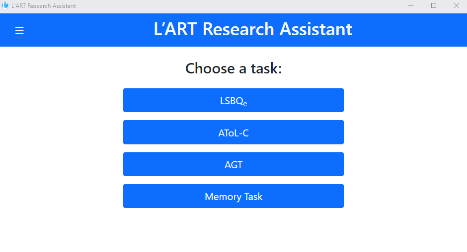
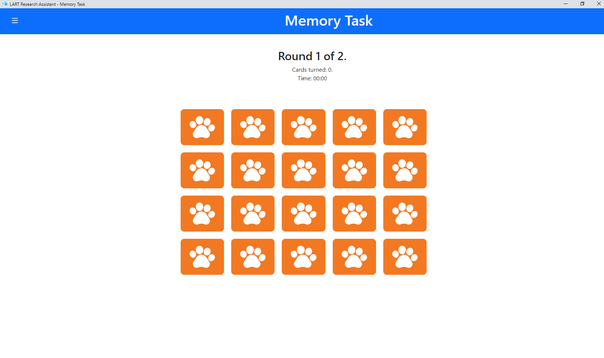
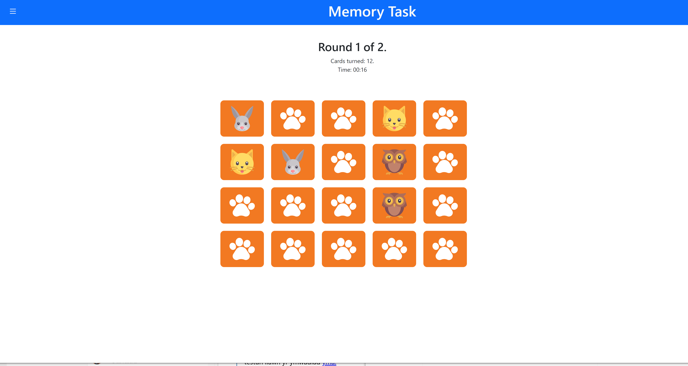
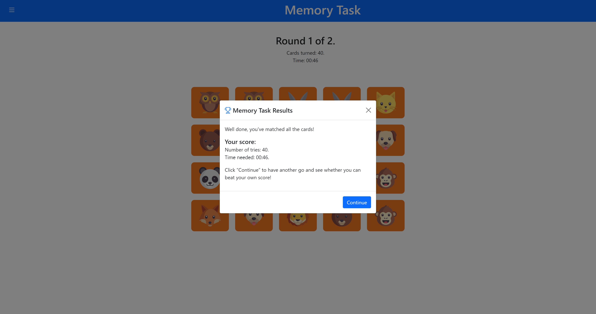

Memory task
-----------

For the purpose of not disclosing to participants that language attitudes are being measured,
a task implementing a simple memory card game is provided to act as a distractor after the
completion of linguistic tasks such as the LSBQe and AToL.  

    Research Client homescreen 

The memory game consists of 20 picture cards in which participants are tasked to match each card
with its respective pair in the shortest amount of time possible. Once a card has been clicked,
only then the timer will begin. As seen in :numref:`memory_task_1`, all cards are faced down and
only two cards are able to be revealed at a time, therefore the participant must try to memorise
the card locations. 

    Starting screen of memory task 

    Matching identical card pairs in the memory task

There are a total of two rounds in which the participant is given the opportunity to achieve a higher score.

After completing the memory task, a congratulatory results screen will appear.
Results are displayed after each round as seen in :numref:`memory_task_first_results` and  
data for the memory task will not be saved.

As this is purely a distractor task, participants will still be informed that their
'data has been saved automatically' as seen in :numref:`memory_task_conclusion` before
continuing on to the next task.

.. figure:: figures-mt/memory_task_conclusion
    :name: memory_task_conclusion
    :width: 600
    :alt: Screenshot of memory task conclusion screen

    Memory task conclusion screen
